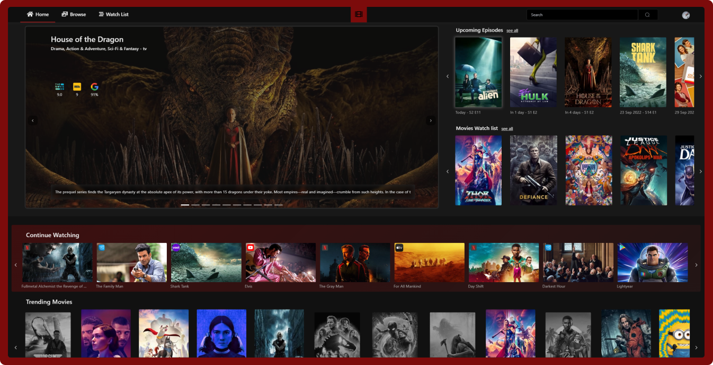
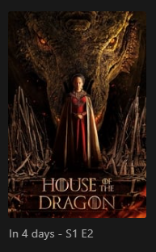
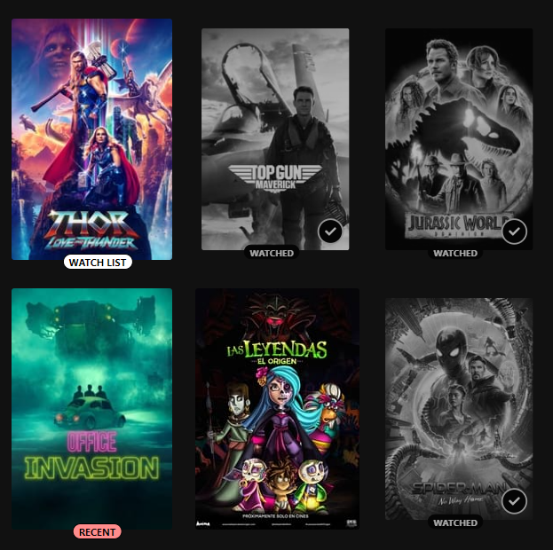
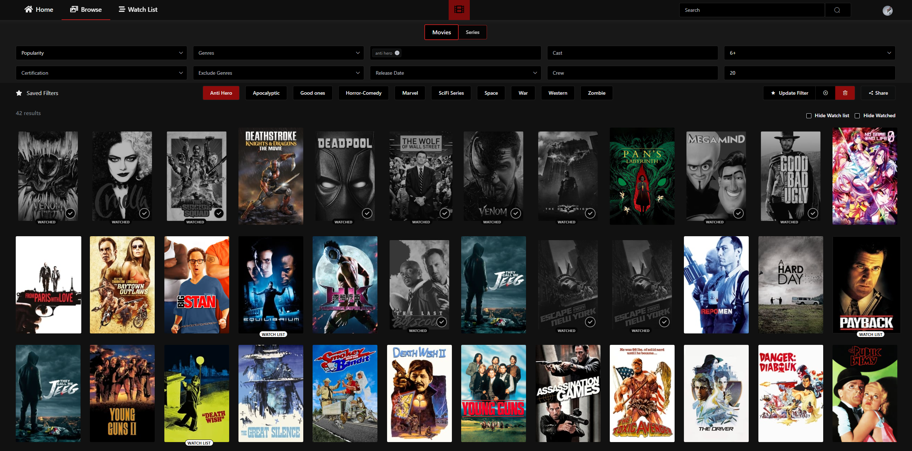
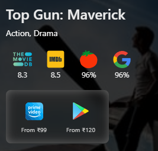
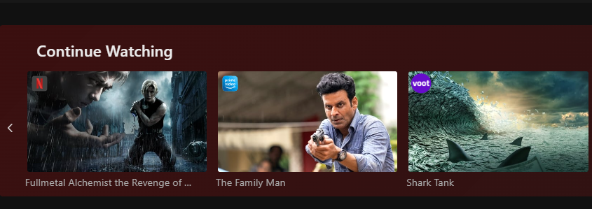
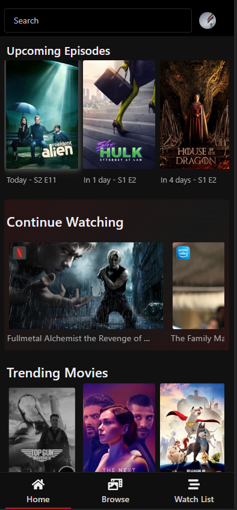

# The Movie Browser
## Powered by TMDB API
Link to the website: https://themoviebrowser.com



Movie Browser is a rich UI wrapper for `TMDB API`
- 🎬 Track the series you are watching

    Series in your watchlist will pop up in your homepage when they are going to be aired

    

- 🐾 Remember and filter out watched content

    Tags and visual aids will help you recognize and filter out watched and other content where its necessary

    

- 🧭 Create custom filters

    Create and save custom filters to your liking, based on keywords, genres, cast, release dates and more, you can even exclude genres and keywords for a truly custom experience

    

- 📺 Get watch links from all major streaming platforms in one place


- ⭐ Check ratings from all major sources in one place

    Check the ratings from major and popular sources in one place to help you make the right decision

    

- 👁️ Quickly see recently viewed streaming content

    View recently viewed streaming content right in the home screen

    

- 📱 Mobile friendly website so you can access your lists from anywhere

    access most of the features on a smaller screen (w.i.p to make mobile experience richer)

    

## Tech stack:
- TMDB API - All the api backend for movies, series and custom filters
- Vuejs and element ui - Frontend
- Nodejs and express  - Backend
- Puppeteer (on google results) - Ratings and watch links
- Firebase - Authentication and real time storage
## Setup steps:

Add a `.env` file to the project root with your TMDB API KEY
and the URL for the server (add port 3000 to it as server uses that by default, ignore if running on localhost)

```
VUE_APP_API_KEY=<YOUR TMDB API KEY HERE>
VUE_APP_SERVER_URL=<SERVER URL HERE - IGNORE IF RUNNING ON LOCALHOST>
```

##### linux terminal / mac terminal / windows powershell

Run server (uses port 3000):

-   `cd ./server && node ./server.js`

Run Webapp (uses port 80):

-   `npm install && npm run serve`
