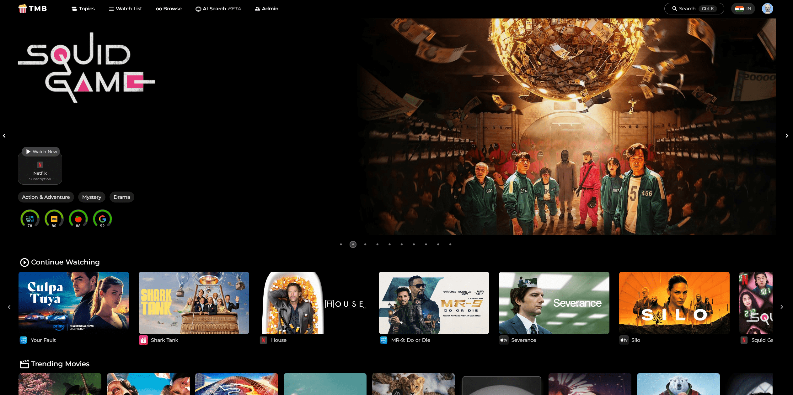

# The Movie Browser
Link to the website: [themoviebrowser.com](https://themoviebrowser.com)

Created by: [Chaitanya Vootla](https://vootlachaitanya.com) visit my site for more projects info and contact details.



TMB is a movie and TV show discovery platform that helps you find the right content to watch. With features like ratings, watch links, watchlist, discovery and AI recommendations TMB is the only platform you need to find your next watch.
 
 - Feel like you've watched everything? TMB begs to differ with its powerful discovery feature.
 - Not sure if a movie is worth watching? TMB has ratings from multiple sources.
 - Not sure when the next episodes of all your favorite TV shows air? TMB has you covered.
 - Want to quickly jump to your favorite streaming service to continue watching? TMB has watch links for that.
 - Want to watch every last zombie movie? TMB has a filter for that.
 - Want to find movies that are war comedies that are available on amazon prime? OK, - TMB doesnt have a filter for that, but you can create your own
check this out, seems like you're looking for [Tropic Thunder](https://themoviebrowser.com/browse?discover=JTdCJTIybWVkaWFfdHlwZSUyMiUzQSUyMm1vdmllJTIyJTJDJTIyc29ydF9ieSUyMiUzQSUyMnBvcHVsYXJpdHkuZGVzYyUyMiUyQyUyMndpdGhfZ2VucmVzJTIyJTNBJTVCMTA3NTIlMkMzNSU1RCUyQyUyMndpdGhfa2V5d29yZHMlMjIlM0ElNUIlNUQlMkMlMjJ3aXRoX29yaWdpbmFsX2xhbmd1YWdlJTIyJTNBbnVsbCUyQyUyMndpdGhvdXRfZ2VucmVzJTIyJTNBJTVCJTVEJTJDJTIyd2l0aF93YXRjaF9wcm92aWRlcnMlMjIlM0ElNUI5JTJDMTAlNUQlMkMlMjJ3aXRoX2Nhc3QlMjIlM0ElNUIlNUQlMkMlMjJ3aXRoX2NyZXclMjIlM0ElNUIlNUQlMkMlMjJ3aXRoX3dhdGNoX21vbmV0aXphdGlvbl90eXBlcyUyMiUzQSUyMiUyMiUyQyUyMndhdGNoX3JlZ2lvbiUyMiUzQSUyMklOJTIyJTJDJTIyd2l0aF9ydW50aW1lLmd0ZSUyMiUzQSUyMiUyMiUyQyUyMndpdGhfcnVudGltZS5sdGUlMjIlM0ElMjIlMjIlMkMlMjJ3aXRoX3JlbGVhc2VfdHlwZSUyMiUzQSUyMiUyMiUyQyUyMnZvdGVfYXZlcmFnZS5ndGUlMjIlM0FudWxsJTJDJTIydm90ZV9jb3VudC5ndGUlMjIlM0FudWxsJTdE)
## Tech stack:
- TMDB API - All the api backend for movies, series and custom filters
- Nuxt
- AWS Lambda for ratings and watch links using puppeteer
- MongoDB on docker
- ChromaDB for AI recommendations using OpenAI's embeddings
## Setup steps:

Add a `.env` file to the project root from the template shown in template.env file

```
npm i
```
```
npm run dev
```
### For vector database setup
Go to VectorDB folder, copy .env from root you created before to this place and add an additional entry `OPENAI_API_KEY` with your openai api key for creating embeddings, dont worry the new OpenAI embeddings cost is super low and will barely cost a couple of cents for 20k movies.

Create a python venv and install the requirements.txt file, then run this to create the embeddings in the chromaDB
```
python3 openai/create.py
```

Then run this to start the server
```
python3 openai/server.py
```
