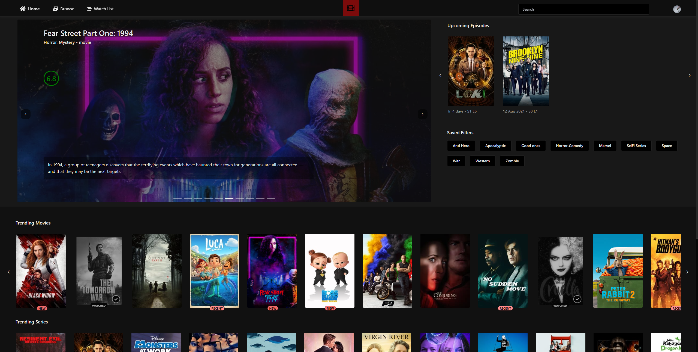

# The Movie Browser

Live link: https://themoviebrowser.com



## Setup steps:

Add a `.env` file to the project root with your TMDB API KEY
and the URL for the server (add port 3000 to it as server uses that by default, ignore if running on localhost)

```
VUE_APP_API_KEY=<YOUR TMDB API KEY HERE>
VUE_APP_SERVER_URL=<SERVER URL HERE - IGNORE IF RUNNING ON LOCALHOST>
```

##### linux terminal / mac terminal / windows powershell

Run server (uses port 3000):

-   `cd ./server && node ./server.js`

Run Webapp (uses port 80):

-   `npm install && npm run serve`
