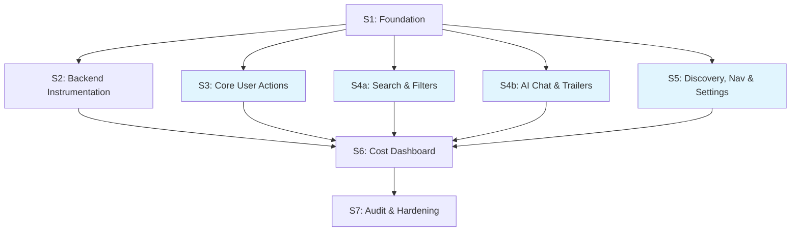

# Full Analytics & Cost Tracking for GA

> Plug all tracking gaps — user interactions, AI/ML cost accounting, embedding usage, and unified cost dashboard — to achieve complete observability before GA launch.

## Context & Motivation

The analytics infrastructure (ClickHouse, admin dashboard, ingest pipeline, bot detection, session fingerprinting) is enterprise-grade. However, critical gaps prevent GA-readiness:

1. **`useAnalytics` hook is defined but never imported** — the `user_actions` ClickHouse table is empty. Zero visibility into watchlist, ratings, watch clicks, search, filters, or any user behavior.
2. **Embedding costs are invisible** — Cohere Embed v4 calls (per-request search + batch generation) have no cost tracking, no pricing config, no dashboard visibility.
3. **LLM query parser is untracked** — Tier 3 search classification (~5% of queries) uses Kimi K2 via Bedrock but doesn't send to ClickHouse.
4. **No unified cost view** — LLM chat costs are in `ai_usage`, Lambda costs are estimated from `api_calls`, embedding costs are nowhere. No single place to answer "what did we spend today?"
5. **Missing action types** — search result clicks, topic selection, carousel navigation, gallery interactions, and settings changes have no tracking infrastructure.

**References:**
- ClickHouse schema: `analytics/clickhouse/init/001-schema.sql`
- Analytics hook (unused): `src/hooks/use-analytics.ts`
- Model pricing: `src/lib/model-pricing.ts`
- Tracking functions: `src/lib/analytics/track.ts`
- Admin dashboard: `src/components/features/admin/`
- GA readiness doc: `docs/GA_READINESS.md`

## Architecture Decisions

| Decision | Choice | Alternatives Considered | Risk | Rationale |
|----------|--------|------------------------|------|-----------|
| Embedding tracking table | Extend `api_calls` with `tokens` column, use `service='embedding'` | New `embedding_usage` table; Reuse `ai_usage` with embedding query_type | Low | Embeddings are external API calls — fits `api_calls` semantically. Adding one column is simpler than a new table. Avoids polluting `ai_usage` with non-chat events. |
| LLM parser tracking | Send to `ai_usage` with `query_type='search_llm_parsing'` | New table; Track only in Pino logs | Low | It IS an LLM invocation with tokens/cost — `ai_usage` is the right home. New query_type keeps it separate from chat. Automatically flows into `hourly_ai_costs` materialized view. |
| Cost aggregation approach | Query-time aggregation across `ai_usage` + `api_calls` | New `cost_aggregation` table with materialized views | Low | Event volume is low (<1000 AI + embedding calls/day). Direct queries are fast enough. Avoids maintaining another table + MV. Revisit if volume grows 100x. |
| New action types | Add to existing `ActionType` enum in `types.ts` | Separate event types per category | Low | Flat enum is consistent with existing pattern. `metadata` JSON field provides per-action flexibility. Dashboard queries filter by action type already. |
| Client tracking wiring | Import `useAnalytics` hook in each component, call convenience methods | Central event bus; HOC wrapper; Middleware approach | Low | Direct hook calls are explicit, type-safe, and follow existing React patterns. No abstraction overhead. Easy to audit which components track what. |
| Embedding cost calculation | Calculate at query time from tokens + pricing table | Store cost at insertion time | Low | Same approach as Lambda cost estimation. Pricing may change — query-time calculation always uses current rates. |

## Reusability & Consolidation

**Existing patterns leveraged:**
- `useAnalytics` hook (`src/hooks/use-analytics.ts`) — 13 convenience methods already written, just needs importing
- `trackAPICall()` in `track.ts` — extended for embedding tracking with minimal changes
- `trackAIUsage()` in `track.ts` — reused directly for LLM parser tracking
- `model-pricing.ts` — centralized pricing map, extended with Cohere pricing
- Lambda cost estimation pattern in `queries/lambda.ts` — same approach for embedding costs
- Admin dashboard tab pattern — consistent React component structure for new cost tab

**Patterns extracted by this plan:**
- None needed — existing patterns are well-structured and reusable as-is

**New abstractions introduced:**
- `trackEmbeddingCall()` — thin convenience wrapper over `trackAPICall()` with embedding-specific defaults
- `getEmbeddingCostEstimate()` — query function following the `estimateLambdaCost()` pattern
- `getUnifiedCostBreakdown()` — aggregation query across `ai_usage` + `api_calls` tables

## Process Configuration

**Tier:** Complex
**Signals:** Cross-cutting (analytics hook across 15+ components), Data migrations (minor — ClickHouse schema extension)
**Verification:** on
**Review:** on (full)
**Parallel:** on (group A: sessions 3, 4a, 4b, 5)
**Architecture review:** off
**Red team:** off
**Audit agents:** 3 (Session Scope Auditor + Codebase Feasibility Agent + Dependency Chain Validator)

> **Classification rationale:** 8 sessions (7 excluding audit) at Complex baseline. Two signals: cross-cutting analytics hook wired across 15+ components in different domains; minor ClickHouse schema extension. No security-sensitive changes, no breaking changes, parallel sessions have zero file overlap.

## Sessions

| Session | Title | Size | Dependencies | Parallel Group | Status | Notes |
|---------|-------|------|--------------|----------------|--------|-------|
| 1 | Foundation — Pricing, Types, Schema, Tracking Functions | medium | None | - | **Complete** | All types, pricing, schema, and tracking functions implemented. `yarn typecheck` passes. |
| 2 | Backend Instrumentation — Embeddings & LLM Parser | medium | Session 1 | - | **Complete** | All embedding + LLM parser tracking instrumented. `yarn typecheck` passes. |
| 3 | Wire Core User Actions | medium | Session 1 | A | **Complete** | All 4 components wired with `useAnalytics`. `yarn typecheck && yarn lint` passes (4 pre-existing errors in unrelated files). |
| 4a | Wire Search & Filters | medium | Session 1 | A | Pending | search-command, filter-sidebar, video-gallery |
| 4b | Wire AI Chat & Trailers | medium | Session 1 | A | Pending | AI chat components, trailer-carousel |
| 5 | Wire Discovery, Navigation & Settings | medium | Session 1 | A | Pending | topics, carousels, galleries, settings |
| 6 | Unified Cost Dashboard & Analytics Queries | medium | Sessions 1, 2, 3-5 | - | Pending | Admin dashboard cost breakdown |
| 7 | Audit & Hardening | medium | All | - | Pending | End-to-end verification, docs update |

---

### Session 1: Foundation — Pricing, Types, Schema, Tracking Functions

**Goal:** Add all missing types, pricing data, schema extensions, and tracking functions needed by subsequent sessions.

**Scope:**
- [x] Add Cohere Embed v4 pricing to `MODEL_PRICING` in `src/lib/model-pricing.ts` — Added `cohere.embed-v4:0` and `global.cohere.embed-v4:0` entries with $0.001/1K input tokens, 0 output (embedding models).
- [x] Add new `ActionType` values to `src/lib/analytics/types.ts`: `search_result_click`, `topic_select`, `mood_select`, `carousel_nav`, `gallery_open`, `gallery_nav`, `settings_change`, `continue_watching_click` — All 8 values added to the union type.
- [x] Add `search_llm_parsing` and `embedding_query` and `embedding_document` to `QueryType` in types.ts — All 3 values added to the union type.
- [x] Add `tokens` field (`UInt32 DEFAULT 0`) to `api_calls` table in `analytics/clickhouse/init/001-schema.sql`, plus `| 'embedding'` to the service column comment — Added `tokens UInt32 DEFAULT 0` column and updated service comment to list all 5 services. Added migration comment for existing DBs.
- [x] Extend `TrackAPICallOptions` interface in `src/lib/analytics/track.ts`: add optional `tokens?: number` field, extend the `service` type union to include `'embedding'`, and pass `tokens` through in `trackAPICall()` — Done. Also changed embedding calls to insert immediately (like lambda) since they're low-volume and important for cost tracking.
- [x] Create `trackEmbeddingCall(options)` convenience function in `track.ts` — Calls `trackAPICall` with `service: 'embedding'`, `method: 'POST'`, and passes through endpoint, tokens, durationMs, statusCode, errorType.
- [x] Create `trackSearchLLMUsage(options)` function in `track.ts` — Calls `trackAIUsage()` with `queryType: 'search_llm_parsing'`, `turns: 1`, `toolCalls: []`, `hadToolRecovery: false`, and sensible defaults for optional fields (sessionId, country, etc.).
- [x] Add `getEmbeddingPricing(inputType: string)` helper to `model-pricing.ts` — Returns `{ costPer1kTokens, modelName, inputType }`. Also added `calculateEmbeddingCost(tokens, inputType)` utility for direct cost calculation.

**Key files:** `src/lib/model-pricing.ts`, `src/lib/analytics/types.ts`, `src/lib/analytics/track.ts`, `analytics/clickhouse/init/001-schema.sql`

**Acceptance Criteria:**
- GIVEN the updated types WHEN importing `ActionType` and `QueryType` THEN all new values are available and `yarn typecheck` passes
- GIVEN the new tracking functions WHEN calling `trackEmbeddingCall()` and `trackSearchLLMUsage()` THEN they produce valid events matching ClickHouse schema
- GIVEN the updated schema SQL WHEN applied to ClickHouse THEN `api_calls` table accepts rows with `tokens` field

**Verification Command:** `yarn typecheck`

**Notes:** No migration needed — just update the schema SQL file. Next deploy recreates ClickHouse containers with fresh schema. Pre-GA data loss is acceptable.

---

### Session 2: Backend Instrumentation — Embeddings & LLM Parser

**Goal:** Instrument all server-side embedding generation and LLM parser calls to send tracking events to ClickHouse.

**Scope:**
- [x] Instrument `generateQueryEmbedding()` in `src/lib/embeddings/cohere-generator.ts` — Wrapped with timing. On success, calls `trackEmbeddingCall()` with `inputType: 'search_query'`, estimated tokens, duration, status 200. On failure, tracks with status 500 and error type. All tracking wrapped in try-catch (fire-and-forget).
- [x] Instrument `generateDocumentEmbedding()` in `src/lib/embeddings/cohere-generator.ts` — Added `skipTracking` boolean parameter (default false). When `skipTracking=false`, tracks on success (status 200) and failure (status 500) with `inputType: 'search_document'`. Batch callers pass `skipTracking=true`.
- [x] Instrument batch embedding functions (`generateMovieEmbeddings`, `generateSeriesEmbeddings`) — Inner `generateDocumentEmbedding` calls pass `skipTracking=true`. At batch completion, a single `trackEmbeddingCall()` is sent with `endpoint: '${COHERE_MODEL_ID}:batch:${count}'`, aggregate tokens, total duration. Uses status 207 for partial failures.
- [x] Instrument `parseQueryWithLlm()` in `src/lib/search/llm-query-parser.ts` — After successful parse (before cache set), calls `trackSearchLLMUsage()` with input/output tokens from Bedrock response `usage` field, cost calculated via `calculateCost()`, model name from `getModelPricing()`, query text (truncated to 500 chars), and response length. Wrapped in try-catch.
- [x] Add cost calculation to AI summarization in `scripts/summarize-movies.ts` — Added `calculateCost()` + `formatCost()` imports. After each summary, logs per-item cost with token breakdown. In batch mode, logs total cost in the summary report. Uses console.log (CLI script, not ClickHouse).

**Key files:** `src/lib/embeddings/cohere-generator.ts`, `src/lib/search/llm-query-parser.ts`, `scripts/summarize-movies.ts`

**Acceptance Criteria:**
- GIVEN a semantic search query WHEN `generateQueryEmbedding()` is called THEN a tracking event is sent to ClickHouse `api_calls` table with `service='embedding'`, `tokens > 0`, `duration_ms > 0`
- GIVEN a Tier 3 search query WHEN `parseQueryWithLlm()` is called THEN a tracking event is sent to ClickHouse `ai_usage` table with `query_type='search_llm_parsing'`, `input_tokens > 0`, `total_cost > 0`
- GIVEN batch embedding operations (e.g., `generateMovieEmbeddings`) WHEN complete THEN a single aggregate tracking event is sent to `api_calls` with `endpoint` containing the batch count (e.g., `cohere.embed-v4:0:batch:150`)
- GIVEN the tracking instrumentation WHEN any tracking call fails THEN the original function still succeeds (tracking is fire-and-forget)
- GIVEN all changes WHEN running `yarn typecheck` THEN no type errors

**Verification Command:** `yarn typecheck`

**Notes:** All tracking calls must be fire-and-forget (no `await`, wrapped in try-catch). Embedding calls are on the hot path for search — tracking must not add latency. The summarization script runs offline so Pino logging is sufficient (no ClickHouse needed for batch scripts).

---

### Session 3: Wire Core User Actions

**Goal:** Wire `useAnalytics` into the core interaction components so watchlist, rating, watched, watch clicks, and share actions are tracked.

**Scope:**
- [x] Wire `useAnalytics` in `src/components/features/media/media-actions.tsx` — Added `trackWatchlistAdd`/`trackWatchlistRemove` in `handleWatchlistToggle()` (tracks add when `!wasInWatchlist`, remove otherwise), `trackRating` in `handleLike()`/`handleDislike()` (tracks like/dislike or remove based on previous state), `trackWatched` in `handleWatchedToggle()`, `trackShareClick` in `handleShare()` (distinguishes `native_share` vs `clipboard` platform). All tracking fires after the optimistic UI update succeeds.
- [x] Wire `useAnalytics` in `src/components/features/media/watch-options.tsx` — Added `trackWatchClick` call at the top of `handleWatchClick()` before `window.open`, passing `item.id`, derived `mediaType`, `option.displayName`, and item title.
- [x] Wire `useAnalytics` in `src/components/features/movie/movie-card-actions.tsx` — Added `trackWatchlistAdd`/`trackWatchlistRemove` in `handleWatchlistClick()` (checks `inWatchlist` state before toggle) and `trackWatched` in `handleWatchedClick()`. MediaType derived from `isMovie` prop (hardcoded to `"movie"` since component only renders for movies).
- [x] Wire `useAnalytics` in `src/components/features/media/wide-card.tsx` — Added `trackAction` with `continue_watching_click` action on the main image Link's `onClick` handler when `showWatchLink && watchLink`. Passes `mediaType`, `itemId`, `title`, and `provider` in metadata.

**Key files:** `src/components/features/media/media-actions.tsx`, `src/components/features/media/watch-options.tsx`, `src/components/features/movie/movie-card-actions.tsx`, `src/components/features/media/wide-card.tsx`

**Acceptance Criteria:**
- GIVEN a logged-in user WHEN they add a movie to watchlist via media-actions THEN a `watchlist_add` event is sent to `/api/analytics/ingest` with correct itemId, mediaType, and title
- GIVEN a user WHEN they click an OTT provider link in watch-options THEN a `watch_click` event is sent with provider name in metadata
- GIVEN a user WHEN they like/dislike a movie THEN `rate_like`/`rate_dislike` events are sent
- GIVEN a user WHEN they click a continue watching link THEN `continue_watching_click` event is sent with itemId and provider
- GIVEN all changes WHEN running `yarn typecheck && yarn lint` THEN no errors

**Verification Command:** `yarn typecheck && yarn lint`

**Notes:** The `useAnalytics` hook already handles DNT respect, session loading, batching, and flush-on-unmount. Just import and call the convenience methods. Track after the optimistic UI update (don't block the interaction). For `watch-options.tsx`, the `handleWatchClick` already opens an external link — add tracking before the window.open/link navigation.

---

### Session 4a: Wire Search & Filters

**Goal:** Wire `useAnalytics` into search command and filter sidebar for complete discovery behavior tracking.

**Scope:**
- [ ] Wire `useAnalytics` in `src/components/features/search/search-command.tsx` (1049 lines — be surgical). Key handlers to instrument: `handleSelectMedia()` (~line 553) for result clicks, `handleSelectTopic()` (~line 565) for topic clicks, `handleSelectMood()` (~line 579) for mood clicks, `handleSelectAutocompleteSuggestion()` (~line 587) for autocomplete. Call `trackSearch(debouncedQuery, resultCount)` when results are fetched. Call `trackAction({ action: 'search_result_click', itemId, mediaType, metadata: { query, resultPosition } })` in `handleSelectMedia`. Call `trackAction({ action: 'topic_select', metadata: { topic } })` in `handleSelectTopic`.
- [ ] Wire `useAnalytics` in `src/components/features/discover/filter-sidebar.tsx` (705 lines). The component has an `onChange` prop that fires on filter changes. Add a debounced tracking wrapper: use a `useRef<NodeJS.Timeout>` to debounce `trackFilterApply` calls by 1 second after the last filter change. Include full filter values in metadata: `{ media_type, genres, rating_gte, vote_count_gte, with_watch_providers, year, primary_release_year_gte/lte, with_cast, with_crew, with_original_language, certification, with_runtime_gte/lte, hide_watched, hide_watchlist, hide_disliked }` — track everything that's set (omit undefined values).
- [ ] Wire `useAnalytics` in `src/components/features/media/video-gallery.tsx` — call `trackTrailerPlay` when a video thumbnail is clicked for playback, passing the TMDB item ID and video name.

**Key files:** `src/components/features/search/search-command.tsx`, `src/components/features/discover/filter-sidebar.tsx`, `src/components/features/media/video-gallery.tsx`

**Acceptance Criteria:**
- GIVEN a user WHEN they search for "inception" and click a result THEN `search_submit` and `search_result_click` events are sent with query text and result metadata
- GIVEN a user WHEN they apply genre + rating filters on browse THEN a `filter_apply` event is sent with full filter values (e.g., `{ genres: [28, 12], rating_gte: 7 }`) after a 1-second debounce
- GIVEN a user WHEN they play a video in the gallery THEN `trailer_play` event is sent with itemId
- GIVEN all changes WHEN running `yarn typecheck && yarn lint` THEN no errors

**Verification Command:** `yarn typecheck && yarn lint`

**Notes:** For `search-command.tsx`, do NOT restructure the component — only add `useAnalytics` import and tracking calls inside existing handler functions. For filter-sidebar debounce pattern: `const debounceRef = useRef<NodeJS.Timeout>(); ... clearTimeout(debounceRef.current); debounceRef.current = setTimeout(() => trackFilterApply(filters), 1000);` with `useEffect` cleanup.

---

### Session 4b: Wire AI Chat & Trailers

**Goal:** Wire `useAnalytics` into AI chat components and trailer carousel for engagement tracking.

**Scope:**
- [ ] Wire `useAnalytics` in `src/components/features/ai/idle-circle.tsx` (145 lines) — this is the floating bubble that opens the chat. Call `trackAIChatOpen()` in the `onExpand` handler (called on click and keyboard Enter/Space). The `onExpand` prop is passed from the parent `assistant-floaty.tsx`.
- [ ] Wire `useAnalytics` in `src/components/features/ai/expanded-chat.tsx` (259 lines) — this is the full chat panel. Call `trackAIChatSubmit(input)` in the `onSend` handler when the user submits a message.
- [ ] Wire `useAnalytics` in `src/components/features/ai/minimal-view.tsx` (520 lines) — this is the compact chat view. If it has its own `onSend` handler (separate from expanded-chat), call `trackAIChatSubmit(input)` there too. If `onSend` is passed as a prop from the parent, track at the source component level.
- [ ] Wire `useAnalytics` in `src/components/features/home/trailer-carousel.tsx` (212 lines) — call `trackTrailerPlay` in `handlePlay(index)` with the trailer's TMDB ID and title.

**Key files:** `src/components/features/ai/idle-circle.tsx`, `src/components/features/ai/expanded-chat.tsx`, `src/components/features/ai/minimal-view.tsx`, `src/components/features/home/trailer-carousel.tsx`

**Acceptance Criteria:**
- GIVEN a user WHEN they click the floating AI bubble THEN `ai_chat_open` event is sent
- GIVEN a user WHEN they submit a chat message THEN `ai_chat_submit` event is sent with query text (truncated to 100 chars)
- GIVEN a user WHEN they play a trailer in the carousel THEN `trailer_play` event is sent with itemId and title
- GIVEN all changes WHEN running `yarn typecheck && yarn lint` THEN no errors

**Verification Command:** `yarn typecheck && yarn lint`

**Notes:** The server-side `trackAIUsage()` already tracks the full agent invocation (tokens, cost, tools). Client-side tracking captures the user's *intent to chat* (open/submit) which happens before server processing. Both are needed — they measure different things. For AI components, the hierarchy is: `assistant-floaty.tsx` (orchestrator) → `idle-circle.tsx` (collapsed bubble) → `expanded-chat.tsx` or `minimal-view.tsx` (active chat).

---

### Session 5: Wire Discovery, Navigation & Settings

**Goal:** Complete the remaining user interaction tracking for topics, carousels, galleries, settings, and external links.

**Scope:**
- [ ] Wire tracking in `src/components/features/home/topic-pills.tsx` — since these are Next.js `Link` components, wrap them or add an `onClick` handler that calls `trackAction({ action: 'topic_select', metadata: { topicKey, topicName } })` before navigation.
- [ ] Wire tracking in `src/components/features/home/mood-cards.tsx` — add `onClick` to mood card links: `trackAction({ action: 'mood_select', metadata: { moodId, moodLabel } })`.
- [ ] Wire tracking in `src/components/features/media/media-scroller.tsx` — track carousel arrow clicks: `trackAction({ action: 'carousel_nav', metadata: { direction: 'prev' | 'next', sectionTitle } })`.
- [ ] Wire tracking in `src/components/features/media/image-gallery.tsx` — track `gallery_open` when lightbox opens and `gallery_nav` on prev/next navigation with image count in metadata.
- [ ] Wire tracking in `src/components/features/auth/settings-menu.tsx` — track `settings_change` when theme, card display mode, background style, or accent color changes: `trackAction({ action: 'settings_change', metadata: { setting, value } })`.
- [ ] Wire tracking in `src/components/features/person/person-hero.tsx` — track `external_link` clicks on social media links (Instagram, Twitter, TMDB) with source in metadata.

**Key files:** `src/components/features/home/topic-pills.tsx`, `src/components/features/home/mood-cards.tsx`, `src/components/features/media/media-scroller.tsx`, `src/components/features/media/image-gallery.tsx`, `src/components/features/auth/settings-menu.tsx`, `src/components/features/person/person-hero.tsx`

**Acceptance Criteria:**
- GIVEN a user WHEN they click a topic pill THEN `topic_select` event is sent with topic key and name
- GIVEN a user WHEN they navigate a carousel THEN `carousel_nav` event is sent with direction
- GIVEN a user WHEN they open and browse an image gallery THEN `gallery_open` and `gallery_nav` events are sent
- GIVEN a user WHEN they change theme in settings THEN `settings_change` event is sent with setting name and new value
- GIVEN a user WHEN they click a social media link on a person page THEN `external_link` event is sent with source (e.g., "instagram", "tmdb")
- GIVEN all changes WHEN running `yarn typecheck && yarn lint` THEN no errors

**Verification Command:** `yarn typecheck && yarn lint`

**Notes:** For Next.js `Link` components (topic-pills, mood-cards), add an `onClick` handler alongside the `href` — the click handler fires before navigation, no `preventDefault` needed. Keep tracking calls lightweight — these are high-frequency interactions (carousel nav). For `image-gallery.tsx` (290 lines, keyboard + touch handlers), add tracking to `goToPrevious()`, `goToNext()`, and the initial open — not every touch event.

---

### Session 6: Unified Cost Dashboard & Analytics Queries

**Goal:** Add embedding cost queries, unified cost breakdown, and an enhanced admin dashboard view showing total spend across all services.

**Scope:**
- [ ] Create `src/lib/analytics/queries/embedding.ts` — add `getEmbeddingUsageOverview(range)` (total calls, tokens, estimated cost from pricing), `getDailyEmbeddingUsage(range)`, `getEmbeddingByType(range)` (search_query vs search_document breakdown). Query `api_calls WHERE service='embedding'`, calculate cost using Cohere pricing from model-pricing.ts.
- [ ] Create `getUnifiedCostBreakdown(range)` query function in a new `src/lib/analytics/queries/costs.ts` — aggregates: LLM chat costs (from `ai_usage WHERE query_type != 'search_llm_parsing'`), LLM search parsing costs (from `ai_usage WHERE query_type = 'search_llm_parsing'`), embedding costs (from `api_calls WHERE service='embedding'`), Lambda costs (reuse `estimateLambdaCost` pattern from `api_calls WHERE service='lambda'`). Returns `{ llmChat, llmSearchParsing, embedding, lambda, total }` with daily breakdown.
- [ ] Add `costs` query type to admin analytics API in `src/app/api/admin/analytics/route.ts` — returns unified cost breakdown
- [ ] Create cost overview component in `src/components/features/admin/tabs/costs-tab.tsx` — show total daily/weekly/monthly spend, breakdown by service (pie chart), daily cost trend (line chart), top cost drivers. Follow the existing tab pattern from `ai-tab.tsx`.
- [ ] Add "Costs" tab to the analytics dashboard tab list in `src/components/features/admin/analytics-dashboard.tsx`
- [ ] Enhance `getUserActionSummary` in `src/lib/analytics/queries/content.ts` — now that user actions are populated, add per-action-type breakdown and trending actions over time
- [ ] Add `embedding` to the admin analytics `overview` response so the main dashboard shows embedding call count alongside other metrics

**Key files:** `src/lib/analytics/queries/embedding.ts` (new), `src/lib/analytics/queries/costs.ts` (new), `src/app/api/admin/analytics/route.ts`, `src/components/features/admin/tabs/costs-tab.tsx` (new), `src/components/features/admin/analytics-dashboard.tsx`, `src/lib/analytics/queries/content.ts`

**Acceptance Criteria:**
- GIVEN embedding and LLM parser events in ClickHouse WHEN querying `getUnifiedCostBreakdown(7)` THEN returns cost breakdown with all four categories and a total
- GIVEN the admin dashboard WHEN clicking the "Costs" tab THEN a cost breakdown pie chart, daily trend line chart, and per-service metrics are displayed
- GIVEN user action events flowing WHEN viewing the content tab THEN user action summary shows counts per action type with breakdown (e.g., watchlist_add: 42, watch_click: 18, search_submit: 95)
- GIVEN all changes WHEN running `yarn typecheck && yarn lint` THEN no errors

**Verification Command:** `yarn typecheck && yarn lint`

**Notes:** Follow the exact pattern of `ai-tab.tsx` for the costs tab — same chart components, same data fetching pattern via `useQuery`, same responsive layout. The cost calculation should be done server-side in the query functions (not client-side) for consistency. For the pie chart, use the existing recharts setup from the analytics dashboard. The content tab enhancement depends on Sessions 3-5 to have populated user_actions data — if those sessions haven't run yet, the content tab will show zero counts (which is correct, just empty).

---

### Session 7: Audit & Hardening

**Goal:** Verify the complete tracking system works end-to-end, fix integration issues, and update documentation.

**Scope:**
- [ ] Verify each session's acceptance criteria with concrete evidence (run verification commands, inspect code)
- [ ] End-to-end flow test: simulate a user journey (page view → search → filter → view detail → add to watchlist → rate → click watch link → play trailer) and verify all events reach the ingest endpoint with correct payloads
- [ ] Verify embedding tracking: trigger a semantic search and confirm an embedding event appears in `api_calls` with `service='embedding'`, `tokens > 0`
- [ ] Verify LLM parser tracking: trigger a complex search that falls to Tier 3 and confirm an event in `ai_usage` with `query_type='search_llm_parsing'`
- [ ] Verify cost dashboard: confirm the costs tab renders with mock or real data, all four cost categories are represented
- [ ] Check that all tracking calls are fire-and-forget (no `await` on tracking, wrapped in try-catch where needed) — analytics must never break the app
- [ ] Check DNT respect: verify the `useAnalytics` hook skips tracking when `navigator.doNotTrack === '1'`
- [ ] Update `CLAUDE.md` — add analytics tracking section documenting: which components are instrumented, how to add tracking to new components, the `useAnalytics` hook API, cost tracking architecture
- [ ] Update `docs/GA_READINESS.md` — mark analytics tracking items as complete
- [ ] Fix any issues discovered during verification

**Key files:** `CLAUDE.md`, `docs/GA_READINESS.md`, any files with issues found during audit

**Acceptance Criteria:**
- GIVEN all prior sessions complete WHEN running `yarn test:ci` THEN all checks pass (typecheck + lint + unit tests)
- GIVEN the complete tracking system WHEN a user performs common actions THEN every action produces a correctly-structured event
- GIVEN the admin dashboard WHEN viewing costs tab THEN unified cost data is displayed across all services
- GIVEN the documentation WHEN a developer reads CLAUDE.md THEN they know how to add tracking to new components

**Verification Command:** `yarn test:ci`

> **Note:** Generic code quality checks (lint, typecheck, TODOs, naming) are handled by `/plan:run`'s built-in audit pass. This session focuses on **feature-specific** verification of the tracking system.

**Notes:**

---

## File Impact Matrix

| File | S1 | S2 | S3 | S4a | S4b | S5 | S6 | S7 |
|------|----|----|----|----|----|----|----|----|
| `src/lib/model-pricing.ts` | M | | | | | | | |
| `src/lib/analytics/types.ts` | M | | | | | | | |
| `src/lib/analytics/track.ts` | M | | | | | | | |
| `analytics/clickhouse/init/001-schema.sql` | M | | | | | | | |
| `src/lib/embeddings/cohere-generator.ts` | | M | | | | | | |
| `src/lib/search/llm-query-parser.ts` | | M | | | | | | |
| `scripts/summarize-movies.ts` | | M | | | | | | |
| `src/components/features/media/media-actions.tsx` | | | M | | | | | |
| `src/components/features/media/watch-options.tsx` | | | M | | | | | |
| `src/components/features/movie/movie-card-actions.tsx` | | | M | | | | | |
| `src/components/features/media/wide-card.tsx` | | | M | | | | | |
| `src/components/features/search/search-command.tsx` | | | | M | | | | |
| `src/components/features/discover/filter-sidebar.tsx` | | | | M | | | | |
| `src/components/features/media/video-gallery.tsx` | | | | M | | | | |
| `src/components/features/ai/idle-circle.tsx` | | | | | M | | | |
| `src/components/features/ai/expanded-chat.tsx` | | | | | M | | | |
| `src/components/features/ai/minimal-view.tsx` | | | | | M | | | |
| `src/components/features/home/trailer-carousel.tsx` | | | | | M | | | |
| `src/components/features/home/topic-pills.tsx` | | | | | | M | | |
| `src/components/features/home/mood-cards.tsx` | | | | | | M | | |
| `src/components/features/media/media-scroller.tsx` | | | | | | M | | |
| `src/components/features/media/image-gallery.tsx` | | | | | | M | | |
| `src/components/features/auth/settings-menu.tsx` | | | | | | M | | |
| `src/components/features/person/person-hero.tsx` | | | | | | M | | |
| `src/lib/analytics/queries/embedding.ts` | | | | | | | C | |
| `src/lib/analytics/queries/costs.ts` | | | | | | | C | |
| `src/components/features/admin/tabs/costs-tab.tsx` | | | | | | | C | |
| `src/components/features/admin/analytics-dashboard.tsx` | | | | | | | M | |
| `src/app/api/admin/analytics/route.ts` | | | | | | | M | |
| `src/lib/analytics/queries/content.ts` | | | | | | | M | |
| `CLAUDE.md` | | | | | | | | M |
| `docs/GA_READINESS.md` | | | | | | | | M |

C = Create, M = Modify

## Dependency Graph

*Blue = Parallel Group A (sessions 3, 4a, 4b, 5 can run concurrently)*

## Progress

[###.....] 37% (3/8 sessions)

## Acceptance Criteria

- [ ] All user interactions (watchlist, ratings, watched, watch clicks, search, filters, AI chat, trailers, topics, carousels, galleries, settings, external links) produce correctly-structured events in ClickHouse `user_actions` table
- [ ] Embedding calls (per-query search + batch generation) are tracked in ClickHouse `api_calls` table with token counts and estimated costs
- [ ] LLM search parser calls are tracked in ClickHouse `ai_usage` table with tokens, costs, and `query_type='search_llm_parsing'`
- [ ] Admin dashboard has a "Costs" tab showing unified spend across LLM chat, LLM parsing, embeddings, and Lambda with daily trends
- [ ] All tracking is fire-and-forget — analytics failures never break the application
- [ ] DNT (Do Not Track) is respected across all client-side tracking
- [ ] `CLAUDE.md` documents the analytics tracking system for future development
- [ ] `yarn test:ci` passes with all changes

## Open Questions

*All resolved.*

| Question | Decision | Rationale |
|----------|----------|-----------|
| ClickHouse migration on EC2 | No migration needed — just update the schema SQL file. Next deploy recreates containers with fresh schema. Pre-GA data loss is acceptable. | Not GA yet, no production data to preserve. |
| Filter tracking privacy | Track full filter values (genres, ratings, providers, year ranges, etc.), not just keys. | Full values are needed to understand what users actually search for — genre popularity, rating thresholds, preferred providers. |
| Batch embedding granularity | One aggregate event per batch. | Per-item events would be 150+ events per batch run, polluting the api_calls table. Aggregate gives the cost/token totals we need. |
