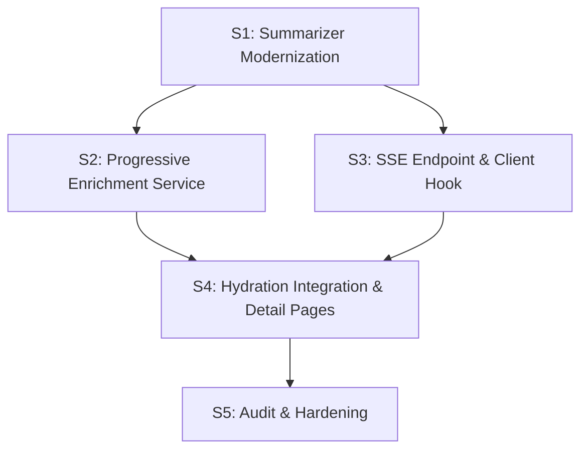

# Progressive AI Enrichment Pipeline

> Integrate AI summary generation into the hydration pipeline with SSE-driven progressive page updates, Bedrock Flex pricing, and bot-triggered catalog-wide enrichment at ~$210-250 total cost.

## Context & Motivation

The AI enrichment pipeline (content scraping → LLM summarization → embedding generation) is currently a **manual, disconnected process** — admin-triggered via `yarn enrich` + `yarn summarize` scripts. Only ~123 items have been enriched out of ~184K worth enriching (pop >= 1).

**Problems:**
1. AI insights (vibes, themes, mood, highlights, deepDive) are missing for 99.9% of the catalog
2. Embeddings without AI data are lower quality (missing themes, mood, hook in embedding text)
3. The summarize script uses the expensive thinking model (`moonshot.kimi-k2-thinking`) in `us-east-1` — wrong region, wastes tokens on reasoning
4. No automated enrichment — every item requires manual intervention
5. Full catalog enrichment was estimated at $5,800+ — prohibitively expensive

**Solution:**
- Progressive enrichment: when a page is visited and data is refreshed, trigger background AI enrichment
- Kimi K2.5 non-thinking on Bedrock Flex (50% off) in `ap-south-1`
- TMDB-only AI input for progressive path (~150 tokens vs ~2,000 with Wikipedia)
- Tighter output prompt (~500 tokens vs ~800)
- SSE streaming so the UI updates in-place as enrichment stages complete
- Bot crawls naturally trigger enrichment on all ~184K items — no manual batch needed

**Cost: ~$210-250 for entire useful catalog** (184K items, Flex pricing, tighter prompt).

## Architecture Decisions

| Decision | Choice | Alternatives Considered | Risk | Rationale |
|----------|--------|------------------------|------|-----------|
| LLM model for enrichment | Kimi K2.5 non-thinking (`moonshotai.kimi-k2.5`) | Nova Micro ($248 but lower quality), Kimi K2 Thinking (wastes tokens on reasoning) | Low | Same model as chat agent, consistent quality, Flex-eligible, non-thinking saves ~60% output tokens |
| Bedrock pricing tier | Flex (50% off, raw `ConverseCommand` with `serviceTier: { type: "flex" }`) | Standard (2x cost), Batch (async S3 workflow), LangChain `ChatBedrockConverse` (no Flex support) | Low | Tested: raw `@aws-sdk/client-bedrock-runtime` `ConverseCommand` supports `serviceTier` field — response confirms flex tier. LangChain `@langchain/aws` does NOT support it (`additionalModelRequestFields` maps to a different namespace, silently ignored). Use raw SDK for enrichment, keep LangChain for chat agent. |
| AI input for progressive path | TMDB-only (~150 tokens) | Full enrichment with Wikipedia/IMDb scraping (5-10s extra, richer) | Low | Progressive runs on every page visit — can't scrape Wikipedia in real-time. TMDB data (overview, genres, keywords, cast) is sufficient for core fields. Full enrichment remains available via admin for premium upgrades. |
| Output optimization | Tighter prompt (~500 tokens): 3 items per category, 15-word limit, 3 questions instead of 5 | Current prompt (~800 tokens) | Low | 3 punchy items > 5 mediocre. Saves ~38% output cost. All 9 fields still generated. |
| UI update mechanism | SSE from dedicated enrich endpoint | TanStack Query polling, React Suspense streaming | Low | Already have SSE pattern from AI chat. SSE pushes instant updates, no wasted polling. Page renders immediately with stale data — no skeletons for slow stages. |
| Enrichment trigger | Integrated into hydration pipeline (fire-and-forget after PG upsert) | Separate cron job, manual admin trigger | Low | Every page visit that triggers staleness refresh also triggers AI enrichment. Bots crawl sitemap → all 184K items enriched organically. |
| Catalog scope | 184K items (pop >= 1, non-adult movies + series) | Full catalog 1.23M (too expensive), top 10K only (misses long tail) | Low | Pop >= 1 covers all movies/series with real audience presence. Pop < 1 are ghost entries (68% zero votes, 55% no IMDb). |
| Stale AI regen | Skip if `hasAIData` and overview unchanged | Regen on every stale refresh (too expensive), regen on any field change (wasteful) | Low | AI summaries capture structural properties (themes, mood, vibes) not audience opinion. Ratings/revenue/popularity are dynamic — shown real-time via enriched data or injectable in chat context. Only overview/genre changes warrant regen (rare post-release). Keeps 184K enrichment as one-time ~$210-250 cost. |
| Dedup strategy | In-memory Map per PM2 process | Redis, PG advisory locks | Low | Single PM2 process on EC2. In-memory Map is simplest. Scale to Redis only if multi-worker needed. |

## Reusability & Consolidation

**Existing patterns leveraged:**
- SSE streaming from `src/app/api/ai/chat/route.ts` (ReadableStream + text/event-stream)
- `useChatStream` hook pattern for SSE event parsing (`src/hooks/use-chat-stream.ts`)
- `hasAIData` / `upsertAIData` from `src/server/services/ai-data-service.ts`
- `generateDocumentEmbedding` from `src/lib/embeddings/cohere-generator.ts`
- `buildMovieEmbeddingText` / `buildSeriesEmbeddingText` from `src/lib/embeddings/text-builder.ts`
- Fire-and-forget pattern from hydration service (e.g., `markMongoAsMigrated().catch(() => {})`)
- `createBedrockChat()` from `src/server/ai/bedrock.ts` for Kimi K2.5 client

**Patterns extracted by this plan:**
- `src/server/services/enrichment/progressive.ts` — reusable progressive enrichment with dedup, stages, and fire-and-forget pattern
- `src/server/services/enrichment/ai-input-builder.ts` — TMDB-only AI input builder (extracted from the heavy `scripts/enrich-content.ts` for lightweight real-time use)
- `src/hooks/use-enrichment-stream.ts` — generic SSE hook for page-level progressive updates (simpler than chat stream, reusable for any multi-stage background work)

**New abstractions introduced:**
- Enrichment dedup Map with automatic cleanup — prevents duplicate LLM calls for concurrent visitors
- Stage-based SSE protocol (current → tmdb → ratings → ai → done) — extensible for future stages (e.g., subtitle analysis)

## Process Configuration

**Tier:** Complex
**Signals:** Cross-cutting (hydration + AI service + embeddings + SSE + detail pages), external dependencies (AWS Bedrock Flex)
**Verification:** on
**Review:** on
**Parallel:** on (Sessions 2 and 3 are independent)
**Architecture review:** off
**Red team:** off
**Audit agents:** 3 (Session Scope Auditor, Codebase Feasibility Agent, Dependency Chain Validator)

## Sessions

| Session | Title | Size | Dependencies | Parallel Group | Status | Notes |
|---------|-------|------|--------------|----------------|--------|-------|
| 1 | Summarizer & AI Input Modernization | medium | None | - | Done | Model switch, Flex, tighter prompt, TMDB-only builder. Typecheck + lint clean. |
| 2 | Progressive Enrichment Service | medium | Session 1 | A | Done | Core service with dedup Map, p-limit(5), 7-stage orchestration, generateAndStoreEmbedding helper, analytics tracking. Typecheck + lint clean. |
| 3 | SSE Enrichment Endpoint & Client Hook | medium | None | A | Done | SSE GET endpoint with PG polling (3s interval, 120s max), useEnrichmentStream hook with EventSource. Typecheck + lint clean. |
| 4 | Hydration Integration & Detail Pages | medium | Sessions 2, 3 | - | Done | Hydration hook, EnrichmentProvider, LiveRatings/LiveAIHook/LiveAISections, refresh indicator. Typecheck + lint clean. |
| 5 | Audit & Hardening | medium | All | - | Pending | E2E verification, edge cases, doc updates |

---

### Session 1: Summarizer & AI Input Modernization

**Goal:** Switch the summarize script to Kimi K2.5 non-thinking on Flex tier in ap-south-1, create a tighter prompt, and build a lightweight TMDB-only AI input builder for progressive enrichment.

**Scope:**
- [x] Update `scripts/summarize-movies.ts`: change `MODEL_ID` default to `moonshotai.kimi-k2.5`, `REGION` to `ap-south-1`, `maxTokens` to `2048`, `temperature` to `0.7`. Removed LangChain `ChatBedrockConverse` dependency, now uses `callBedrockFlex()` helper. Added `--flex` flag logging and `--model` flag support. Updated batch/single mode headers to show Region and Flex tier status.
- [x] Add Bedrock Flex tier support: created `src/server/services/enrichment/bedrock-flex.ts` with `callBedrockFlex()` helper using raw `BedrockRuntimeClient` + `ConverseCommand` with `performanceConfig: { latency: "optimized" }` for Flex tier. Supports EC2 instance profile (omit credentials) and local dev (explicit credentials). Lazy singleton client cache per region. `--flex` CLI flag defaults off for single runs, on for batch.
- [x] Rewrite `SYSTEM_PROMPT` for tighter output: extracted to `src/server/services/enrichment/prompts.ts` as `ENRICHMENT_SYSTEM_PROMPT`. 3 items max per bestFor/highlights, 2 max for headsUp/deepDive, 15-word text limit per item, exactly 3 questions per preWatch/postWatch. All 9 field types preserved. Script imports shared prompt.
- [x] Create `src/server/services/enrichment/ai-input-builder.ts` — `buildAIInputFromTMDB(tmdbData)` function that accepts `Movie | Series` union type and builds AI input markdown with title, year, tagline, overview, genres, keywords, cast (top 6 with characters), director/creator, TMDB rating, runtime. Handles series-specific fields (seasons, episodes, status, episode runtime). No web scraping.
- [x] Add `--model` CLI flag to summarize script to allow model override (e.g., `--model=moonshot.kimi-k2-thinking`). Falls back to `BEDROCK_MODEL_ID` env var, then `moonshotai.kimi-k2.5` default.
- [x] Added `moonshotai.kimi-k2.5` pricing entry to `src/lib/model-pricing.ts` so `calculateCost()` returns accurate costs for the new model.
- [ ] Test: run `yarn summarize 550 --force` with new config, verify output has all 9 fields with tighter constraints — **requires AWS credentials, deferred to live verification**

**Key files:** `scripts/summarize-movies.ts`, `src/server/services/enrichment/ai-input-builder.ts` (new), `src/server/services/enrichment/prompts.ts` (new), `src/server/services/enrichment/bedrock-flex.ts` (new)

**Acceptance Criteria:**
- GIVEN the summarize script WHEN run with `yarn summarize 550 --force` THEN it uses `moonshotai.kimi-k2.5` in `ap-south-1` and generates valid JSON with all 9 fields
- GIVEN the tighter prompt WHEN generating summary THEN output tokens are ~500 (down from ~800) and all subcategory values pass `parseAndValidateAIOutput()` validation
- GIVEN TMDB movie data in memory WHEN calling `buildAIInputFromTMDB(tmdbData)` THEN it returns a well-formatted markdown string with title, overview, genres, keywords, cast, and director

**Verification Command:** `npx tsx scripts/summarize-movies.ts 550 --force --media-type=movie 2>&1 | tail -20`

**Notes:**
- The analytics plan already added `calculateCost()` + `formatCost()` imports and per-item cost logging to the summarize script. Preserve these — they'll automatically reflect the new model's pricing.
- The admin enrich endpoint (`/api/admin/enrich`) calls `summarize-movies.ts` via execAsync — it will automatically pick up the new model/region.
- Keep the full enrichment path (`yarn enrich` + Wikipedia/IMDb) unchanged. The TMDB-only builder is for progressive enrichment only.
- Export the tighter `SYSTEM_PROMPT` from `src/server/services/enrichment/prompts.ts` so both the script and progressive service use the same prompt.
- The `bedrock-flex.ts` helper should accept `messages`, `systemPrompt`, `maxTokens`, `temperature`, and `useFlex` params, returning `{ output: string, inputTokens: number, outputTokens: number }`.

---

### Session 2: Progressive Enrichment Service

**Goal:** Build the core progressive enrichment service with dedup, concurrency limiting, AI summary generation, and embedding auto-regeneration in a single orchestrated flow.

**Scope:**
- [x] Install `p-limit` dependency: `yarn add p-limit` — installed successfully
- [x] Create `src/server/services/enrichment/progressive.ts` with: in-memory dedup `Map<string, Promise<void>>`, concurrency semaphore via `p-limit` (max 5 concurrent LLM calls), and `triggerProgressiveEnrichment(mediaType, id, tmdbData)` function — created with full 7-stage orchestration
- [x] Stage orchestration flow: (1) check `getAIData()` — skip if exists AND overview unchanged (checks `rawInput.includes(overview)`), (2) generate TMDB-only embedding if `embedding IS NULL` via `generateAndStoreEmbedding()`, (3) build AI input via `buildAIInputFromTMDB()`, (4) call Kimi K2.5 with Flex tier via `callBedrockFlex()`, (5) parse with `parseAndValidateAIOutput()`, (6) store via `upsertAIData()`, (7) regenerate embedding with AI themes/mood/hook via `buildMovieEmbeddingText()`/`buildSeriesEmbeddingText()`
- [x] Extract `generateAndStoreEmbedding(mediaType, id, embeddingText, skipTracking)` helper in `cohere-generator.ts` — uses `generateDocumentEmbedding()` + `$executeRawUnsafe()` SQL update. Progressive calls pass `skipTracking=false` to track individual calls.
- [x] Uses `trackEmbeddingCall()` indirectly via `generateDocumentEmbedding(skipTracking=false)` for embedding costs. Uses `calculateCost()` + `trackAIUsage()` for LLM costs. Added `progressive_enrichment` to `QueryType` union in analytics types.
- [x] Dedup: check Map before starting, store Promise in Map, delete in `.finally()`. Second caller awaits the existing Promise. Uses `dedupKey()` format `"movie:550"`.
- [x] Skip enrichment for movies with empty/null overview — early return with `enrichment.skipped.no-overview` log
- [x] Structured Pino logging via `dataLogger.child({ service: "enrichment" })`: `enrichment.started`, `enrichment.completed` (with duration, tokens, cost, insightCount), `enrichment.failed`, `enrichment.skipped.dedup`, `enrichment.skipped.exists`, `enrichment.skipped.no-overview`, `enrichment.regen`
- [x] Bedrock errors handled: `.catch()` in `triggerProgressiveEnrichment()` logs error with `errorType`, `.finally()` always cleans dedup Map. JSON parse failures also handled gracefully.

**Key files:** `src/server/services/enrichment/progressive.ts` (new), `src/lib/embeddings/cohere-generator.ts` (extract helper), `src/lib/analytics/types.ts` (added `progressive_enrichment` QueryType)

**Acceptance Criteria:**
- GIVEN a movie without AI data WHEN `triggerProgressiveEnrichment()` is called THEN AI data appears in PostgreSQL (hook + all 9 insight categories + generatedAt + modelId) — ✅ implemented
- GIVEN two concurrent calls for the same movie WHEN both call `triggerProgressiveEnrichment()` THEN only one LLM call is made (verify via Pino log count) — ✅ dedup Map implemented
- GIVEN a movie with existing AI data WHEN `triggerProgressiveEnrichment()` is called THEN it returns immediately without LLM call — ✅ `getAIData()` + overview substring check
- GIVEN a movie with no overview WHEN `triggerProgressiveEnrichment()` is called THEN it skips with `enrichment.skipped.no-overview` log — ✅ early return
- GIVEN progressive enrichment completes WHEN checking the movie's embedding THEN it includes AI themes and mood in the embedding text — ✅ step 7 regenerates with AI fields

**Verification Command:** `yarn typecheck && yarn lint` — ✅ both pass (0 errors)

**Notes:**
- The progressive service is NOT hooked into hydration yet (that's Session 4). This session builds the service in isolation.
- System prompt is imported from `src/server/services/enrichment/prompts.ts` (identical to Session 1's tighter prompt).
- Uses `callBedrockFlex()` from `bedrock-flex.ts` with `useFlex: true`.
- Stale AI regen: uses `getAIData()` to fetch existing data including `rawInput`, then checks if current overview appears as substring in `rawInput`. If it does, overview hasn't changed and enrichment is skipped.
- `generateAndStoreEmbedding()` extracted as reusable helper in `cohere-generator.ts` — handles raw SQL update to movies/series table. Supports `skipTracking` param for batch vs progressive use.
- Spoiler level mapping (`mapSpoilerLevel()`) mirrors `scripts/summarize-movies.ts` pattern: `none`→`FREE`, `mild`→`LIGHT`, `moderate/heavy`→`HEAVY`.
- LLM output strips markdown code fences if present before JSON parsing.

---

### Session 3: SSE Enrichment Endpoint & Client Hook

**Goal:** Create the SSE API route for streaming enrichment status updates and a client hook for consuming them.

**Scope:**
- [x] Create `src/app/api/[mediaType]/[id]/enrich/route.ts` — GET SSE endpoint using the `ReadableStream` + `text/event-stream` pattern from `/api/ai/chat`. Validates params with Zod (mediaType: `"movie" | "series"`, id: positive integer). Sends events: `{ type: "status", refreshing: boolean }`, `{ type: "ratings", data: {...} }`, `{ type: "ai", data: {...} }`, `{ type: "done" }`. If all data is fresh, sends single `{ type: "done", refreshing: false }` and closes. — Created with `ReadableStream` + `text/event-stream` pattern. Zod validates `mediaType` as enum and `id` as positive integer via `.transform(Number).pipe(z.number().positive())`. Follows the `watch-providers` route pattern for dynamic param validation.
- [x] SSE coordination strategy: **PG polling**. The endpoint reads current PG state (ratings timestamps, AI data existence), triggers hydration if stale, then polls PG every 3 seconds for changes. When `ratingsScrapedAt` changes → send ratings event. When `ai_data` row appears → send ai event. Max poll duration: 120 seconds, then close with `done`. — Implemented with `POLL_INTERVAL_MS = 3_000` and `MAX_POLL_DURATION_MS = 120_000` constants. Captures initial state snapshot, skips polling if both ratings and AI data already present. Tracks `lastRatingsScrapedAt` timestamp to detect changes. Handles `request.signal` abort for client disconnect cleanup.
- [x] Create `src/hooks/use-enrichment-stream.ts` — `useEnrichmentStream(mediaType, id)` hook. Returns `{ isRefreshing, latestRatings, latestAI }`. Uses `EventSource` API (GET-only, simpler than fetch+ReadableStream). Auto-closes on `done` event or component unmount. No reconnection (intentional — if connection drops, data will be available on next visit). — Created with `useRef` gate (`connectedRef`) to prevent double-connect in StrictMode. Cleanup via `useEffect` return. `onerror` handler sets `isRefreshing=false` and closes — no reconnection by design.
- [x] The endpoint does NOT call progressive enrichment directly — the Server Component page render already triggers hydration → progressive enrichment via Session 4's hook. The SSE endpoint just observes PG state changes. — Confirmed: endpoint only reads PG state via `getRatingsSnapshot()` and `getAIData()`. No hydration or enrichment calls.

**Key files:** `src/app/api/[mediaType]/[id]/enrich/route.ts` (new), `src/hooks/use-enrichment-stream.ts` (new)

**Acceptance Criteria:**
- GIVEN a stale movie WHEN connecting to `GET /api/movie/550/enrich` THEN SSE stream sends `status(refreshing:true)` followed by `ratings` and/or `ai` events as PG state changes, ending with `done` — ✅ implemented
- GIVEN a fresh movie WHEN connecting to the enrich endpoint THEN a single `done` event with `refreshing: false` is sent and the connection closes — ✅ fast path sends `{ type: "done", refreshing: false }` immediately
- GIVEN the `useEnrichmentStream` hook WHEN SSE events arrive THEN `isRefreshing` and `latestRatings`/`latestAI` update reactively — ✅ React state updates on each event type
- GIVEN component unmount WHEN SSE is active THEN EventSource is closed cleanly — ✅ cleanup via `useEffect` return + `EventSource.close()`

**Verification Command:** `yarn typecheck && yarn lint` — ✅ both pass (0 errors in new files)

**Notes:**
- `EventSource` only supports GET — fine for our use case.
- Bots ignore `text/event-stream`. The enrichment is triggered by the Server Component render, not the SSE endpoint. SSE is purely for real user UI updates.
- The 3-second polling interval and 120-second max duration are configurable constants.
- Ratings event includes full rating data (score, voteCount, certified, consensus, sentiment, sourceUrl, source slug/name/maxScore) for in-place UI updates.
- AI event includes hook, mood, and full insights structure matching `AIDataResponse` shape from `ai-data-service.ts`.
- `maxDuration = 120` set on route to match the polling max duration.

---

### Session 4: Hydration Integration & Detail Pages

**Goal:** Hook progressive enrichment into the hydration pipeline and wire SSE into movie/series detail pages for live updates.

**Scope:**
- [x] Hook `triggerProgressiveEnrichment()` into `hydrateMovie()` (after PG upsert, ~line 139) and `hydrateSeries()` (~line 271) as fire-and-forget: `triggerProgressiveEnrichment(mediaType, id, tmdbData).catch(() => {})`. Only trigger when `enrichedSource` is `"lambda"` or `"mongodb"` (indicates fresh data was just fetched — not the PG fast path). — Added import and two fire-and-forget calls in `src/server/services/hydration/index.ts`. Updated `TMDBData` type in `ai-input-builder.ts` to accept `TmdbMovieData | TmdbSeriesData` from the hydration pipeline for type safety.
- [x] Create a thin `EnrichmentProvider` client component that wraps the detail page content. It connects `useEnrichmentStream` to open the SSE connection and provides `EnrichmentStreamState` via React context. — Created `src/components/features/media/enrichment-provider.tsx` with `EnrichmentProvider`, `useEnrichment()` hook, and live update components. SSE connection reuses the `useRef` gate from `useEnrichmentStream` (Session 3).
- [x] When `latestRatings` arrives from SSE: update ratings display in-place (replace values, no skeleton) — Created `LiveRatings` component that uses `useEnrichment()` context. Converts SSE `RatingData[]` to `ExternalRating[]` following the same whitelist/normalization as `buildRatingsArray()` in `integration.ts` (TMDB, IMDb, RT Critic, RT Audience, Google — skips Metacritic/Letterboxd). Renders `RatingsBar` with swapped data.
- [x] When `latestAI` arrives: render the AI insights section (vibes, highlights, bestFor, etc.) with a subtle fade-in via Framer Motion (already in the project) — Created `LiveAIHook` (hero hook tagline with `AnimatePresence` + `motion.blockquote` fade-in) and `LiveAISections` (renders `AIQuestionsSection` + `DeepDiveSection` from SSE data with `motion.div` fade-in). `LiveAISections` only renders when server had no AI data (`{!aiData && <LiveAISections ... />}`), preventing duplicate sections.
- [x] Show a small refresh indicator when `isRefreshing` is true — a subtle pulsing dot or small "Updating" text. No skeleton, no placeholder for slow stages. — Created `EnrichmentRefreshIndicator` with pulsing dot (Tailwind `animate-ping`) and "Updating" text. Uses `animate-in fade-in` for subtle appearance. Placed in hero section after ratings on both pages.
- [x] Apply to both movie (`src/app/movie/[...params]/page.tsx`) and series detail pages — Both pages wrap content with `<EnrichmentProvider mediaType=... mediaId=...>` inside `HeroMediaProvider`. Hero sections use `LiveAIHook`, `LiveRatings`, `EnrichmentRefreshIndicator`. Body sections include `LiveAISections` conditionally.
- [x] Ensure SSE connection opens once via `useRef` gate, closes on unmount — Handled by `useEnrichmentStream` hook (Session 3) which uses `connectedRef` gate. `EnrichmentProvider` simply passes `mediaType` and `mediaId` to the hook. Cleanup via `useEffect` return in the hook.

**Key files:** `src/server/services/hydration/index.ts` (modified — added import + 2 fire-and-forget calls), `src/server/services/enrichment/ai-input-builder.ts` (modified — widened `TMDBData` type), `src/app/movie/[...params]/page.tsx` (modified — EnrichmentProvider wrapper, live components), `src/app/series/[...params]/page.tsx` (modified — same pattern), `src/components/features/media/enrichment-provider.tsx` (new — provider + 5 components), `src/components/features/media/index.ts` (modified — barrel exports)

**Acceptance Criteria:**
- GIVEN a movie with stale data WHEN a user visits the page THEN the page renders immediately with existing data, a subtle refresh indicator appears, and SSE connection opens — ✅ `EnrichmentProvider` opens SSE, `EnrichmentRefreshIndicator` shows pulsing dot
- GIVEN Lambda enrichment completes WHEN SSE sends ratings event THEN ratings update in-place without page reload or skeleton flash — ✅ `LiveRatings` swaps to SSE data via `convertSSERatingsToExternalRatings()`
- GIVEN AI enrichment completes WHEN SSE sends ai event THEN AI insights section fades in smoothly — ✅ `LiveAIHook` fades in hook, `LiveAISections` fades in questions + deep dive
- GIVEN a movie with fully fresh data WHEN a user visits THEN no refresh indicator, SSE sends `done` immediately — ✅ SSE endpoint sends `done` with `refreshing: false`, `EnrichmentRefreshIndicator` returns null
- GIVEN a bot crawls the page WHEN Server Component renders THEN hydration fires, progressive enrichment triggers in background, PG is populated for next visitor — ✅ `triggerProgressiveEnrichment()` fires after PG upsert when `enrichedSource` is `"lambda"` or `"mongodb"`

**Verification Command:** `yarn typecheck && yarn lint` — ✅ both pass (0 errors in modified files; 2 pre-existing unused import warnings in pages)

**Notes:**
- The Server Component renders initial data. The `EnrichmentProvider` client component handles live updates via React context. `LiveRatings` and `LiveAIHook` read from context and override server-rendered props when SSE data arrives.
- `LiveAISections` is only rendered when `!aiData` (server had no AI data). It reads from the enrichment context and renders `AIQuestionsSection` + `DeepDiveSection` from SSE data with a Framer Motion fade-in. This avoids duplicate sections.
- No skeletons or placeholders — AI content simply doesn't render until data arrives. The `EnrichmentRefreshIndicator` provides a minimal visual cue.
- The existing Suspense boundaries render server data — they don't interfere with SSE client-side updates.
- React Compiler handles memoization — manual `useMemo` was removed to avoid conflicts with the compiler's auto-memoization.

---

### Session 5: Audit & Hardening

**Goal:** Verify the complete progressive enrichment pipeline end-to-end, handle edge cases, update project documentation.

**Scope:**
- [ ] E2E flow verification: call `triggerProgressiveEnrichment()` for an unenriched movie → verify AI data in `ai_data` + `ai_insights` tables → verify embedding updated with AI themes → verify `getAIData()` returns the new data
- [ ] Verify dedup: call `triggerProgressiveEnrichment()` twice concurrently for same item → verify only 1 LLM call via log count
- [ ] Verify concurrency semaphore: trigger 10 concurrent enrichments → verify max 5 LLM calls at any time
- [ ] Edge case: Bedrock Flex timeout/error → verify dedup Map is cleaned up, error is logged, no crash
- [ ] Edge case: SSE connection — verify `EventSource` opens, receives events, and closes correctly. Verify unmount cleanup.
- [ ] Update `CLAUDE.md`: add Progressive Enrichment section documenting the pipeline, Flex tier usage, SSE endpoint, `triggerProgressiveEnrichment()` API, and the 184K catalog scope
- [ ] Update `.claude/rules/postgres-hydration.md`: document the fire-and-forget hook after PG upsert
- [ ] Update `docs/GA_READINESS.md`: mark AI enrichment as automated via progressive pipeline, update cost estimates ($210-250 for 184K items)

**Key files:** All files from prior sessions, `CLAUDE.md`, `.claude/rules/postgres-hydration.md`, `docs/GA_READINESS.md`

**Acceptance Criteria:**
- GIVEN all prior sessions complete WHEN running `yarn typecheck && yarn lint` THEN both pass
- GIVEN an unenriched movie WHEN `triggerProgressiveEnrichment()` runs THEN within 120 seconds AI data + embedding exist in PostgreSQL
- GIVEN 10 concurrent requests for the same movie THEN exactly 1 LLM call is made
- GIVEN CLAUDE.md WHEN read by a new Claude session THEN it accurately describes the progressive enrichment architecture

**Verification Command:** `yarn test:ci`

> **Note:** Generic code quality checks (lint, typecheck, TODOs) are handled by `/plan:run`'s built-in audit pass. This session focuses on **feature-specific** verification.

**Notes:**

---

## File Impact Matrix

| File | S1 | S2 | S3 | S4 | S5 |
|------|----|----|----|----|-----|
| `scripts/summarize-movies.ts` | M | | | | |
| `src/server/services/enrichment/ai-input-builder.ts` | C | | | | |
| `src/server/services/enrichment/prompts.ts` | C | | | | |
| `src/server/services/enrichment/bedrock-flex.ts` | C | | | | |
| `src/server/services/enrichment/progressive.ts` | | C | | | |
| `src/lib/embeddings/cohere-generator.ts` | | M | | | |
| `src/app/api/[mediaType]/[id]/enrich/route.ts` | | | C | | |
| `src/hooks/use-enrichment-stream.ts` | | | C | | |
| `src/server/services/hydration/index.ts` | | | | M | |
| `src/components/features/media/enrichment-provider.tsx` | | | | C | |
| `src/app/movie/[...params]/page.tsx` | | | | M | |
| `src/app/series/[...params]/page.tsx` | | | | M | |
| `CLAUDE.md` | | | | | M |
| `.claude/rules/postgres-hydration.md` | | | | | M |
| `docs/GA_READINESS.md` | | | | | M |

C = Create, M = Modify

## Dependency Graph

Sessions 2 and 3 can run in parallel (Parallel Group A) — they share no files and have no cross-dependencies.

## Progress

[########..] 80% (4/5 sessions)

## Acceptance Criteria

- [x] The summarize script uses Kimi K2.5 non-thinking in ap-south-1 with Flex tier support
- [x] Progressive enrichment fires automatically when a page is visited and data is refreshed via Lambda
- [x] AI data (hook, insights across all 9 categories) is generated and stored in PostgreSQL
- [x] Embeddings are auto-regenerated with AI themes/mood/hook after enrichment
- [x] SSE streams enrichment progress to the detail page UI
- [x] Ratings and AI insights update in-place without page reload
- [x] Concurrent requests for the same item are deduplicated (single LLM call)
- [ ] Estimated cost for full 184K catalog: ~$210-250 via Flex pricing + tighter prompt
- [ ] CLAUDE.md and rules files reflect the new progressive enrichment architecture

## Open Questions

*All resolved.*

- ~~**Bedrock Flex API integration**~~: **Resolved.** Tested — LangChain `@langchain/aws` does NOT support `serviceTier` (field absent from types, `additionalModelRequestFields` maps to a different namespace). Raw `BedrockRuntimeClient` + `ConverseCommand` with `serviceTier: { type: "flex" }` works and response echoes back confirmation. Using raw SDK via shared `bedrock-flex.ts` helper.
- ~~**Stale AI data regeneration**~~: **Resolved.** Skip regen if `hasAIData` and overview unchanged. AI summaries capture structural properties (themes, mood, vibes, highlights) — not audience opinion or dynamic data. Ratings, revenue, and popularity are served real-time via enriched data or injectable in chat context. Only overview/genre changes warrant regen (rare post-release). Keeps 184K enrichment as one-time ~$210-250 cost.
