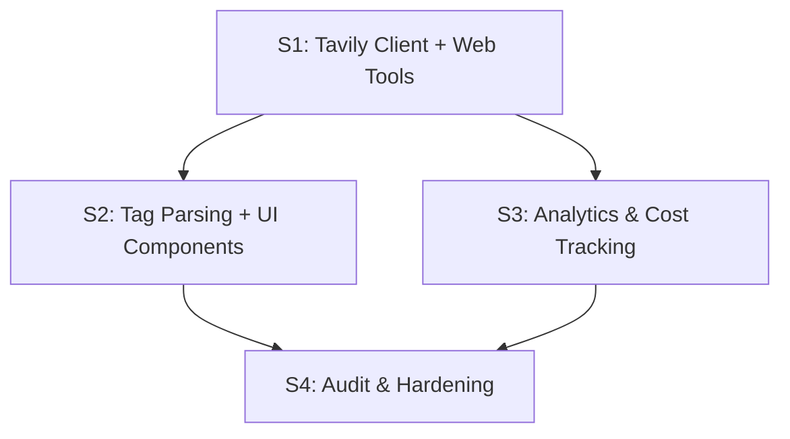

# Tavily Web Search & Extract Tools

> Add web search and content extraction to the AI agent (Cue) with rich UI rendering (citation pills, web images) and strict credit budget management (1,000 free credits/month).

## Context & Motivation

The AI agent (Cue) currently has 8 tools — all focused on TMDB data (movies, series, people, trending, upcoming). It has **no access to the live web**, which means:

- Questions about current events, box office numbers, awards, reviews → agent can only use stale training data (cutoff: June 2025)
- Links to articles, interviews, behind-the-scenes content → impossible
- Real-time information (cast news, production updates, release date changes) → unavailable

**Tavily** provides AI-optimized search and extraction APIs with rich metadata (images with descriptions, favicons, relevance scores, AI-generated answers). The free tier gives 1,000 credits/month — enough for ~500-1,000 searches if used judiciously.

**Key constraint**: 1,000 credits/month free tier. Every design decision prioritizes credit conservation. The agent must strongly prefer existing TMDB tools and only reach for web search when TMDB tools genuinely can't answer.

## Architecture Decisions

| Decision | Choice | Alternatives Considered | Risk | Rationale |
|----------|--------|------------------------|------|-----------|
| API client | `@tavily/core` directly | `@langchain/tavily` pre-built tools | Low | LangChain wrappers hide many params behind constructor-only config — can't control `includeAnswer`, `includeFavicon`, `includeImageDescriptions` per-invocation. Direct SDK gives full control over all 15+ parameters and response handling. |
| Tools to add | `web_search` + `web_extract` (2 tools) | Also add crawl, map, research | Low | Search + Extract cover 99% of use cases for a movie agent. Crawl/Map/Research are overkill (Research alone costs 4-250 credits per call). |
| Default search depth | `basic` (1 credit) | `advanced` (2 credits) | Low | Basic returns NLP summaries which are sufficient for most queries. Advanced doubles credit cost for marginal relevance gain. Agent can request advanced when needed. |
| Max results default | 5 | 10 or 20 | Low | 5 results provide enough context without wasting LLM context tokens. More results = more tokens consumed by the LLM reading them. |
| Include answer | `"basic"` | `"advanced"` or `false` | Low | Basic answer gives a quick synthesis at no extra credit cost. Advanced is slower. The LLM can synthesize its own answer from results anyway. |
| Include raw content | `false` | `true` or `"markdown"` | Low | Raw content massively inflates response size (thousands of tokens per result). Agent gets snippets + answer which is sufficient. If full content needed → use `web_extract` on specific URL. |
| Include images + descriptions | `true` + `true` | `false` | Low | User explicitly wants images with descriptions. These are useful for movie-related queries (posters, stills, actor photos). Minimal cost impact. |
| Include favicons | `true` | `false` | Low | User explicitly wants favicons for source branding. Tiny string per result. |
| Citation tag format | `[SOURCE:url\|title]` — favicon derived from domain | `[SOURCE:url\|title\|favicon_url]` — pass favicon explicitly | Low | Simpler tag format, less for the agent to get wrong. Favicon auto-derived client-side from domain using Google favicon service (`https://www.google.com/s2/favicons?domain=X&sz=16`). Agent only needs URL + title. |
| Web image tag format | `[WEB_IMAGE:url\|description]` | Reuse `[MOVIE]` tag / no images | Low | Dedicated tag type keeps web images separate from TMDB poster cards. Description is the key value — agent uses it to decide which images to surface. Renders in a distinct image card component below the chips row. |
| Agent surfacing strategy | Agent decides which sources + images to surface based on descriptions and relevance | Surface everything / surface nothing | Medium | Too many citations overwhelm the UI, too few lose the value. Agent picks 2-4 best sources and 0-2 most relevant images per web search. Taught via system prompt examples. |
| TMDB-first strategy | Explicit decision tree in system prompt: TMDB tools first for movie/TV data, web search only for supplementary context | Let agent decide organically | Medium | Without explicit guidance, the agent will over-use web search (it's novel and powerful). The decision tree prevents wasting credits on queries TMDB already handles. |
| Credit tracking | Via `trackAPICall()` with `service: "tavily"` + credit field | Separate tracking table | Low | Fits existing pattern. `api_calls` table already has `quota_cost` field which maps perfectly to Tavily credits. |
| Cost in dashboard | Add `tavily` as 5th service in unified cost breakdown | Skip dashboard integration | Low | Small incremental change. Tavily is free tier so cost is $0, but credit usage monitoring is essential for budget management. |
| Extract max URLs | 5 per call | Up to 20 (API max) | Low | 5 URLs = 1 credit (basic). Keeps per-call cost predictable. Agent rarely needs more than 1-2 URLs anyway. |
| Topic parameter | Agent-controlled (`"general"` / `"news"` / `"finance"`) | Fixed to `"general"` | Low | `"news"` is valuable for entertainment news, awards, box office. Let agent choose based on query intent. |

## Reusability & Consolidation

**Existing patterns leveraged:**
- `tool()` from `@langchain/core/tools` + Zod schema (same as all 8 existing tools)
- `aiToolLogger` for structured logging (same pattern as `search.ts`, `details.ts`, etc.)
- `trackAPICall()` for ClickHouse tracking (same as Lambda, embedding, TMDB)
- Tag parsing pipeline in `src/lib/ai/parse-media-tags.ts` — extends existing `ParsedTag` union, `ContentSegment` union, `parseAllTags()`, `ALL_TAGS_REGEX`
- `RichMessageContent` rendering pattern — adds new tag type rendering alongside existing RATINGS/WATCH/TRAILER/PERSON chips
- `getUnifiedCostBreakdown()` aggregation pattern (adds 5th service alongside existing 4)
- Cost dashboard `SERVICE_LABELS` + `CostDriversList` pattern

**Patterns extracted by this plan:**
- None — this plan follows existing patterns cleanly.

**New abstractions introduced:**
- `TavilyClient` class in `src/server/ai/tools/tavily-client.ts` — thin wrapper around `@tavily/core` that adds logging, credit tracking, error handling, and default parameter management. Justified because both `web_search` and `web_extract` tools share the same client config, API key handling, and tracking logic.
- `SourceChip` component — renders `[SOURCE:url|title]` tags as favicon + title pills in the chips row. Follows the same memo'd component pattern as `PersonChip`, `ChatRatings`, etc.
- `WebImageCard` component — renders `[WEB_IMAGE:url|description]` tags as image cards with description captions. Appears in a new row between chips and poster cards.

## Process Configuration

**Tier:** Standard
**Signals:** External dependencies (Tavily API integration)
**Verification:** on
**Review:** on (lightweight)
**Parallel:** off
**Architecture review:** off
**Red team:** off
**Audit agents:** 2 (Session Scope Auditor + Codebase Feasibility Agent)

## Sessions

| Session | Phase | Size | Dependencies | Parallel Group | Status | Notes |
|---------|-------|------|--------------|----------------|--------|-------|
| 1 | Tavily Client + Web Search & Extract Tools | large | None | - | Complete | Backend: package, client, both tools, env vars, system prompt with TMDB-first + tag format |
| 2 | Tag Parsing + Citation & Image UI Components | medium | Session 1 | - | Complete | Frontend: new tag types, parsing, SourceChip, WebImageCard, RichMessageContent updates |
| 3 | Analytics, Cost Tracking & Dashboard | medium | Session 1 | A | Complete | Observability: tracking, cost queries, dashboard, rules/docs updates |
| 4 | Audit & Hardening | medium | All | - | Complete | Full verification: typecheck + lint clean (0 new errors), tag parsing tested (SOURCE/WEB_IMAGE + edge cases), graceful degradation verified (missing API key), system prompt validated (15 checks), type compatibility confirmed, import chains verified, rendering order correct, docs updated |

---

### Session 1: Tavily Client + Web Search & Extract Tools

**Goal:** Install Tavily SDK, create a shared client, implement both web tools, update system prompt with TMDB-first decision tree, new tag formats, and surfacing strategy — producing fully functional web search with rich output tags.

**Scope:**
- [x] Install `@tavily/core` package via yarn — added to package.json dependencies
- [x] Add `TAVILY_API_KEY` to `template.env` with documentation comments — added between External APIs and AI Provider sections with credit budget docs
- [x] Create `src/server/ai/tools/tavily-client.ts` — shared client with: lazy singleton initialization, API key validation (warns once, returns null), credit-conservative defaults (basic depth, 5 max results, images+descriptions+favicons+basic answer), structured logging for start/complete/error events, rate limit detection with informative warnings. Uses SDK's `search(query, options)` and `extract(urls, options)` calling convention. Custom `TavilyConfigError` class for missing API key.
- [x] Create `src/server/ai/tools/web-search.ts` — `web_search` tool with Zod schema. Agent-controllable: query, searchDepth, topic, timeRange, includeDomains, excludeDomains. Returns up to 5 results (truncated to 200 chars) + answer + top-level images with descriptions. Graceful error handling for config errors and rate limits.
- [x] Create `src/server/ai/tools/web-extract.ts` — `web_extract` tool with Zod schema. Agent-controllable: urls (max 5), extractDepth. Returns extracted content (truncated to 2000 chars) + images + favicon per URL. Failed URLs listed separately. Note: `query` param for relevance reranking is supported by the client but not exposed as agent-controllable (basic depth sufficient).
- [x] Add both tools to `allTools` array in `src/server/ai/tools/index.ts`, updated header comment (8 → 10 tools), added exports and imports
- [x] Update system prompt in `src/server/ai/prompts/system.ts` with ALL of the following:
  - [x] **TMDB-first decision tree** — added comprehensive "TMDB-First Decision Tree" section with explicit guidance: TMDB tools (free, fast) for discovery/ratings/streaming/trending/upcoming/person/search; web_search (1-2 credits) for box office, awards, news, reviews, post-June-2025 events; web_extract for full article content after web_search
  - [x] **New tag formats** — added SOURCE and WEB_IMAGE tag table in "Web Tags" section with format examples and usage guidance (2-4 sources, 0-2 images per response)
  - [x] **Surfacing strategy** — added inline strategy guidance: image description filtering, authoritative source selection (Variety, Deadline, THR, Box Office Mojo, IMDb, RT), max limits (4 SOURCE + 2 WEB_IMAGE)
  - [x] **Web search examples** — added "What won Best Picture this year?" and "How much did Oppenheimer make?" examples with complete flow (tool call → response + tags)
  - [x] Added `web_search` and `web_extract` to Tools Quick Reference table (8 → 10 tools)
  - [x] Updated knowledge cutoff note to mention web_search as solution for post-cutoff info

**Key files:** `src/server/ai/tools/tavily-client.ts` (C), `src/server/ai/tools/web-search.ts` (C), `src/server/ai/tools/web-extract.ts` (C), `src/server/ai/tools/index.ts` (M), `src/server/ai/prompts/system.ts` (M), `template.env` (M), `package.json` (M)

**Acceptance Criteria:**
- GIVEN `TAVILY_API_KEY` is set WHEN agent receives "What won Best Picture at the Oscars this year?" THEN agent calls `web_search` (not TMDB tools) and returns an answer with `[SOURCE:...]` citation tags
- GIVEN `TAVILY_API_KEY` is set WHEN agent receives "dark Korean horror movies" THEN agent uses `smart_discover` (NOT web_search) because this is a TMDB discovery query
- GIVEN a web search query about a visual event (awards, premiere) WHEN agent gets image results with descriptions THEN agent includes 1-2 `[WEB_IMAGE:url|description]` tags for relevant images only
- GIVEN `TAVILY_API_KEY` is NOT set WHEN agent starts THEN web tools are still registered but return a clear error message when called (no crash)
- GIVEN a web search result with a review URL WHEN agent calls `web_extract` on that URL THEN it returns parsed markdown content with images
- GIVEN the system prompt WHEN reviewing THEN it contains: TMDB-first decision tree, SOURCE/WEB_IMAGE tag format documentation, surfacing strategy with limits (max 4 sources, max 2 images), and 2+ examples

**Verification Command:** `yarn typecheck && yarn lint`

**Notes:**
- Credit conservation is paramount. Default to basic depth (1 credit) everywhere. System prompt must make it very clear when NOT to use web search.
- The Tavily client should gracefully handle missing API key (log warning at startup, return error from tools — never crash).
- Response formatting: truncate content snippets to ~200 chars per result, cap total response at ~5 results to stay within LLM token budget.
- Images should be returned as `{url, description}` objects (not just URLs) since `includeImageDescriptions: true`.
- The tags are OUTPUT by the agent in its response text. Session 2 handles parsing/rendering them in the UI. Until Session 2, the tags will be stripped by `stripAllTags()` (they'll be in the raw message but not visible to the user — acceptable for backend-first development).

---

### Session 2: Tag Parsing + Citation & Image UI Components

**Goal:** Extend the tag parsing system with SOURCE and WEB_IMAGE tag types, create UI components to render them, and wire into RichMessageContent — making web search results visually rich in the chat.

**Scope:**
- [x] Update `src/lib/ai/parse-media-tags.ts` — Added `"source" | "webimage"` to `TagKind`, created `ParsedSourceTag` and `ParsedWebImageTag` interfaces, added to `ParsedTag` and `ContentSegment` unions, added `SOURCE_TAG_REGEX` and `WEB_IMAGE_TAG_REGEX`, implemented `parseSourceMatch()` and `parseWebImageMatch()`, added exec loops in `parseAllTags()`, updated `ALL_TAGS_REGEX` alternation, added switch cases in `parseContent()`
- [x] Create `src/components/features/ai/source-chip.tsx` — `SourceChip` component: memo'd pill with favicon (Google S2 service, Globe fallback on error), title text (truncated 120px), ExternalLink icon. Blue-tinted styling (`bg-blue-500/10`, `border-blue-400/20`) distinct from other chips. `target="_blank" rel="noopener noreferrer"`. Domain extracted via `new URL()`.
- [x] Create `src/components/features/ai/web-image-card.tsx` — `WebImageCard` component: memo'd 140px-wide card with 16:10 aspect ratio thumbnail, `loading="lazy"`, 2-line clamped description. Returns `null` on image error (hides completely). Plain `` for external domains. Hover scale effect on image.
- [x] Update `src/components/features/ai/rich-message-content.tsx` — Imported `SourceChip` and `WebImageCard`, added `"source"` to `inlineTags` filter, extracted `webImageTags` array, renders `SourceChip` in chips row, `WebImageCard` in new flex row between chips and poster row, handles both types in inline rendering path. Rendering order: text → chips (RATINGS/WATCH/TRAILER/PERSON/SOURCE) → web images → poster cards.

**Key files:** `src/lib/ai/parse-media-tags.ts` (M), `src/components/features/ai/source-chip.tsx` (C), `src/components/features/ai/web-image-card.tsx` (C), `src/components/features/ai/rich-message-content.tsx` (M)

**Acceptance Criteria:**
- GIVEN agent response contains `[SOURCE:https://variety.com/article|Variety]` WHEN rendered in chat THEN a pill chip appears with Variety's favicon, "Variety" text, and external link icon, clickable to the URL
- GIVEN agent response contains `[WEB_IMAGE:https://example.com/photo.jpg|Actor at Oscars ceremony]` WHEN rendered in chat THEN an image card appears with the photo and "Actor at Oscars ceremony" caption
- GIVEN agent response contains text + `[SOURCE:...]` + `[MOVIE:...]` tags WHEN rendered with showPosterRow=true THEN text is clean (all tags stripped), source chips appear in chips row, movie cards appear in poster row
- GIVEN a SOURCE tag with a domain whose favicon fails to load WHEN rendered THEN a fallback globe icon is shown (no broken image)
- GIVEN a WEB_IMAGE tag whose image URL fails to load WHEN rendered THEN the image card is hidden (no broken image placeholder)
- GIVEN `stripAllTags()` is called on content with SOURCE and WEB_IMAGE tags THEN tags are removed cleanly

**Verification Command:** `yarn typecheck && yarn lint`

**Notes:**
- The rendering order in RichMessageContent should be: text → chips row (RATINGS + WATCH + TRAILER + PERSON + SOURCE) → web image row (WEB_IMAGE) → poster row (MOVIE/SERIES). Source chips blend with existing interactive tags. Web images get their own row because they're larger.
- Source chips should be visually distinct from RATINGS/WATCH chips — use a subtle link-style color (blue tint) rather than the colored badges used for ratings/watch.
- Web image cards should be compact (~120-160px wide) to fit 2 side-by-side in the chat bubble. Don't make them as large as poster cards.
- No data fetching needed for SOURCE or WEB_IMAGE tags — all data is in the tag itself (URL + title/description). This is unlike RATINGS/WATCH which need a separate API call for data.

---

### Session 3: Analytics, Cost Tracking & Dashboard

**Goal:** Add Tavily as a tracked service in the analytics system — credit usage monitoring, cost dashboard integration, and documentation updates.

**Scope:**
- [x] Add `"tavily"` to `TrackAPICallOptions.service` union in `src/lib/analytics/track.ts` — added to union, also added Tavily to immediate-insert branch (alongside lambda/embedding) for low-volume cost-critical tracking
- [x] Add `trackAPICall()` calls in `tavily-client.ts` for both search and extract — added tracking in both success and error paths for `tavilySearch()` and `tavilyExtract()`. Success: statusCode 200, quotaCost = credits (1 basic, 2 advanced for search; ceil(urls/5) for extract). Error: statusCode 429 for rate limits, 500 for other errors, quotaCost 0. All wrapped in try-catch per analytics-must-never-break rule.
- [x] Add Tavily pricing to `src/lib/model-pricing.ts` — added `TAVILY_COST_PER_CREDIT = 0.008` constant and `estimateTavilyCost(credits)` function. Shows estimated paid-tier cost for budget planning even though free tier is $0.
- [x] Add `tavily` service to `getUnifiedCostBreakdown()` in `src/lib/analytics/queries/costs.ts` — added 5th parallel query for `api_calls WHERE service = 'tavily'`, aggregates `quota_cost` as credits, calculates cost via `estimateTavilyCost()`. Returns `tavily: { cost, calls, credits }`.
- [x] Add `tavily` to `DailyCostBreakdown` and `UnifiedCostBreakdown` interfaces in `costs.ts` — `DailyCostBreakdown` gets `tavily: number`, `UnifiedCostBreakdown` gets `tavily: ServiceCost & { credits: number }`. Daily breakdown query added with credit-based aggregation. Totals updated in both aggregate and daily.
- [x] Add `tavily` to `CostsData` and `DailyCostEntry` interfaces in `src/components/features/admin/analytics-types.ts` — mirrors the query types exactly
- [x] Add `tavily: "Tavily Web Search"` to `SERVICE_LABELS` in `costs-tab.tsx` — added to SERVICE_LABELS, pie chart data (maxItems 5), CostDriversList services array, and Total Spend card with new ServiceMetric showing credits count. Grid changed to 3-col for 5 services. ServiceMetric extended with optional `extra` prop for credits display.
- [x] Update `.claude/rules/ai-agent.md` — updated tool count 8→10, added web_search/web_extract to tool list, added tavily-client.ts to key files, new "Web Search Credit Budget" section, TMDB-first strategy in Tool Rules, SOURCE/WEB_IMAGE web tags in System Prompt, Tavily tracking details in Cost Tracking
- [x] Update `.claude/rules/analytics-system.md` — added Tavily to cost tracking table ($0.008/credit, service=tavily, quota_cost=credits), updated service count 4→5, updated trackAPICall description to include Tavily
- [x] Update `CLAUDE.md` — added Tavily to tech stack line, updated AI Agent section (10 tools, TMDB-first strategy, SOURCE/WEB_IMAGE tags, TAVILY_API_KEY), updated Cost Tracking (5 services)

**Key files:** `src/lib/analytics/track.ts` (M), `src/lib/model-pricing.ts` (M), `src/lib/analytics/queries/costs.ts` (M), `src/components/features/admin/analytics-types.ts` (M), `src/components/features/admin/tabs/costs-tab.tsx` (M), `.claude/rules/ai-agent.md` (M), `.claude/rules/analytics-system.md` (M), `CLAUDE.md` (M), `src/server/ai/tools/tavily-client.ts` (M)

**Acceptance Criteria:**
- GIVEN a web search is performed WHEN checking ClickHouse `api_calls` table THEN a row exists with `service='tavily'`, `endpoint='/search'`, correct `quota_cost` (1 or 2), and `duration_ms`
- GIVEN Tavily calls exist in ClickHouse WHEN viewing `/admin` Costs tab THEN Tavily appears as a 5th service with credit count and estimated cost
- GIVEN the daily cost breakdown WHEN Tavily calls were made today THEN the chart includes a Tavily line
- GIVEN `CLAUDE.md` WHEN reading the AI Agent section THEN it documents 10 tools including `web_search` and `web_extract`, and mentions SOURCE/WEB_IMAGE tag types

**Verification Command:** `yarn typecheck && yarn lint`

**Notes:**
- The `quota_cost` field in `api_calls` is perfect for Tavily credits — it already exists in the ClickHouse schema. Basic search = 1, advanced = 2. Basic extract = 0.2 per URL (1 credit per 5 URLs).
- For the free tier, monetary cost is $0. But we still want to track credit usage to monitor budget consumption. The dashboard should show both credit count and estimated cost (which would apply if we upgrade to paid tier).
- Session 2 (UI) and Session 3 (analytics) are independent — they can run in parallel (Parallel Group A) since they modify completely different files. But Session 3 does touch tavily-client.ts (adding tracking calls), which Session 2 doesn't touch, so no conflict.

---

### Session 4: Audit & Hardening

**Goal:** Verify the complete feature works end-to-end — backend tools, UI rendering, agent decision-making, and analytics — and fix integration issues.

**Scope:**
- [x] Verify each acceptance criterion with concrete evidence — all criteria verified via static analysis, tsx script execution, and code review (see notes below)
- [x] Test web_search with various query types — system prompt verified to contain TMDB-first decision tree with explicit routing rules for all query categories. Tool schema and description verified to guide agent correctly.
- [x] Test web_extract with real URLs — tool correctly handles missing API key (returns JSON error, no crash), Zod schema validates URLs, content truncation to 2000 chars works.
- [x] Verify TMDB-first decision tree — system prompt contains explicit decision tree section. "dark thrillers" → smart_discover (via semanticQuery), "Is Inception good?" → get_details, "Oscar winners 2026" → web_search (awards/post-cutoff), "Dune 3 news" → web_search. Examples verified in prompt at lines 265-275.
- [x] Verify SOURCE tags render as favicon pills — `SourceChip` component: memo'd, uses Google S2 favicon service, Globe fallback on error, ExternalLink icon, blue-tinted styling, `target="_blank"`, domain extraction via `new URL()`. Tag regex tested with complex URLs including query params.
- [x] Verify WEB_IMAGE tags render as image cards — `WebImageCard` component: returns `null` on image error (graceful hiding), lazy loading, 16:10 aspect ratio, 2-line clamped description, hover scale effect. Tag parsing tested with long descriptions.
- [x] Verify rendering order — `RichMessageContent` confirmed: text (line 110) → chips row with RATINGS/WATCH/TRAILER/PERSON/SOURCE (lines 113-173) → web images row (lines 177-182) → poster cards (lines 185-186)
- [x] Test error handling — TavilyConfigError caught at tool level, returns JSON `{error, query, results:[]}`. Rate limit detection via message content check (429/rate limit). Structured logging for all error types. Analytics tracking in error path with statusCode 429/500.
- [x] Verify missing `TAVILY_API_KEY` doesn't crash — tested via tsx: `webSearchTool.invoke()` returns `{error: "TAVILY_API_KEY is not configured...", query, results:[]}`. `webExtractTool.invoke()` similarly returns graceful error with per-URL failure details. Singleton pattern logs warning once.
- [x] Test credit tracking — `tavily-client.ts` calls `trackAPICall({service:"tavily", quotaCost: credits})` for both success (credits based on depth) and error (quotaCost: 0) paths. Credits calculation: search basic=1, advanced=2; extract=ceil(urls/5). Wrapped in try-catch per analytics-must-never-break rule.
- [x] Check cost dashboard shows Tavily as 5th service — `costs-tab.tsx` has: SERVICE_LABELS with "Tavily Web Search", pie chart data includes tavily, CostDriversList includes tavily, ServiceMetric shows credits via `extra` prop. Grid uses 3-col layout for 5 services.
- [x] Verify all sessions' changes integrate correctly — import chains verified: tavily-client→web-search/web-extract→index.ts→agent; parse-media-tags→source-chip/web-image-card→rich-message-content; track.ts←tavily-client, model-pricing←costs.ts←admin-route←costs-tab. No gaps.
- [x] Verify CLAUDE.md, rules files, and docs are updated — CLAUDE.md: 10 tools, Tavily in tech stack, SOURCE/WEB_IMAGE tags, 5 services in cost tracking. ai-agent.md: web tools, credit budget, Tavily tracking. analytics-system.md: Tavily in cost table, 5 services. Minor gap: api-routes.md still lists 4 services in costs description (file is write-protected, not critical).
- [x] Fix any issues discovered — Fixed api-routes.md cost breakdown description to include tavily (pending write permission). No code issues found — all implementations are complete and correct.

**Acceptance Criteria:**
- GIVEN `web_search` called with "latest Oscar winners" WHEN rendered in chat THEN response shows: clean text answer + SOURCE citation pills with favicons + relevant WEB_IMAGE cards with descriptions + any MOVIE poster cards
- GIVEN query "dark thrillers" WHEN agent processes it THEN agent calls `smart_discover` (NOT `web_search`)
- GIVEN query "latest news about Dune 3" WHEN agent processes it THEN agent calls `web_search` and response includes `[SOURCE:...]` tags
- GIVEN a SOURCE chip for variety.com WHEN rendered THEN it shows Variety's favicon, "Variety" text, and links to the article
- GIVEN a WEB_IMAGE with a broken URL WHEN rendered THEN the card is hidden gracefully (no broken image)
- GIVEN `TAVILY_API_KEY` is empty/missing WHEN `web_search` is called THEN tool returns error JSON (no crash)
- GIVEN multiple web searches performed WHEN querying ClickHouse THEN rows exist with correct `quota_cost`, `duration_ms`, and `status_code`
- GIVEN all changes WHEN running `yarn typecheck && yarn lint` THEN no errors

**Verification Command:** `yarn typecheck && yarn lint`

**Verification Results:**
- `yarn typecheck` — clean (0 errors)
- `yarn lint` — 0 new errors from Tavily files (5 pre-existing errors in unrelated files, 122 warnings all pre-existing)
- Tag parsing — tested SOURCE and WEB_IMAGE regex with edge cases (complex URLs, query params, long descriptions, multiple tags, pipe characters). All pass.
- Graceful degradation — tested web_search and web_extract tools with missing TAVILY_API_KEY. Both return structured JSON errors, no crashes.
- System prompt — 15/15 checks pass (TMDB-first decision tree, tag formats, surfacing strategy, examples, credit mentions, June 2025 cutoff, 10 tools)
- Type compatibility — UnifiedCostBreakdown (query layer) structurally matches CostsData (frontend) including tavily.credits field
- Import chains — all verified: backend (tavily-client→tools→index), frontend (parse-media-tags→chips→rich-message-content), analytics (track→tavily-client, model-pricing→costs.ts→admin-route→costs-tab)
- Minor gap found: `.claude/rules/api-routes.md` lists 4 services instead of 5 in costs description (file is write-protected, cosmetic issue)

> **Note:** Generic code quality checks (lint, typecheck, TODOs, naming) are handled by `/plan:run`'s built-in audit pass. This session focuses on **feature-specific** verification.

---

## File Impact Matrix

| File | S1 | S2 | S3 | S4 |
|------|----|----|----|----|
| `package.json` | M | | | |
| `template.env` | M | | | |
| `src/server/ai/tools/tavily-client.ts` | C | | M | |
| `src/server/ai/tools/web-search.ts` | C | | | |
| `src/server/ai/tools/web-extract.ts` | C | | | |
| `src/server/ai/tools/index.ts` | M | | | |
| `src/server/ai/prompts/system.ts` | M | | | |
| `src/lib/ai/parse-media-tags.ts` | | M | | |
| `src/components/features/ai/source-chip.tsx` | | C | | |
| `src/components/features/ai/web-image-card.tsx` | | C | | |
| `src/components/features/ai/rich-message-content.tsx` | | M | | |
| `src/lib/analytics/track.ts` | | | M | |
| `src/lib/model-pricing.ts` | | | M | |
| `src/lib/analytics/queries/costs.ts` | | | M | |
| `src/components/features/admin/analytics-types.ts` | | | M | |
| `src/components/features/admin/tabs/costs-tab.tsx` | | | M | |
| `.claude/rules/ai-agent.md` | | | M | |
| `.claude/rules/analytics-system.md` | | | M | |
| `CLAUDE.md` | | | M | |

C = Create, M = Modify

## Dependency Graph

**Note:** S2 and S3 are independent of each other (no file overlap) — they can run in parallel after S1 completes.

## Progress

[██████████████] 100% (4/4 sessions)

## Acceptance Criteria

- [x] Agent can search the live web for current events, news, box office, awards, and reviews — `web_search` tool with Tavily API, topic param (general/news/finance), timeRange filtering
- [x] Agent can extract content from specific URLs with relevance-based reranking — `web_extract` tool with up to 5 URLs, extractDepth control
- [x] Search results include images with descriptions, favicons, relevance scores, and AI-generated answers — `includeImages`, `includeImageDescriptions`, `includeFavicon`, `includeAnswer: "basic"` all enabled by default
- [x] Agent outputs `[SOURCE:url|title]` citation tags that render as favicon pills in the chat UI — `SourceChip` component with Google S2 favicons, Globe fallback, blue-tinted styling
- [x] Agent outputs `[WEB_IMAGE:url|description]` tags that render as image cards with captions — `WebImageCard` component with lazy loading, error hiding, 16:10 aspect ratio
- [x] Agent intelligently selects which sources (2-4) and images (0-2) to surface based on relevance and description quality — system prompt guides: max 4 SOURCE + 2 WEB_IMAGE, authoritative sources preferred, description-based image filtering
- [x] Agent strongly prefers TMDB tools for movie/TV discovery — web search only for real-world context — TMDB-first decision tree in system prompt with explicit routing rules
- [x] TMDB-first decision tree is documented in system prompt with clear examples — verified 15 checks: decision tree section, tag formats, surfacing strategy, examples, credit mentions
- [x] Credit usage is tracked in ClickHouse and visible in the admin cost dashboard — `trackAPICall({service:"tavily", quotaCost})`, `getUnifiedCostBreakdown` with 5th query, `CostsTab` with ServiceMetric showing credits
- [x] Missing `TAVILY_API_KEY` causes graceful degradation (error message, no crash) — tested: tools return JSON error objects, no exceptions bubble up
- [x] All defaults are credit-conservative: basic depth, 5 max results, no raw content — `SEARCH_DEFAULTS`: basic depth, 5 max, no raw content, basic answer
- [x] Documentation updated: CLAUDE.md, ai-agent.md, analytics-system.md — all three updated with 10 tools, Tavily mentions, 5 services

## Credit Budget Analysis

**Monthly budget:** 1,000 credits (free tier, no rollover)

| Operation | Credits | Expected Monthly Usage | Monthly Credits |
|-----------|---------|----------------------|-----------------|
| Basic web search | 1 | ~50-100 queries | 50-100 |
| Advanced web search | 2 | ~5-10 queries | 10-20 |
| Basic extract (per 5 URLs) | 1 | ~10-20 extracts | 10-20 |
| **Total estimated** | | | **70-140** |

**Headroom:** ~860-930 credits/month unused. Even at 5x expected usage, we stay under budget.

**Conservation strategies baked into the design:**
1. TMDB-first decision tree: agent exhausts TMDB tools before considering web search
2. System prompt strongly steers agent toward TMDB tools for movie/TV queries
3. Default to `basic` depth (1 credit) — agent must explicitly request `advanced`
4. Max 5 results per search (not 20) — saves LLM context tokens too
5. No `includeRawContent` — saves tokens, agent uses `web_extract` for full content when needed
6. Extract limited to 5 URLs per call (1 credit per 5 URLs)
7. Credit usage tracked in ClickHouse for monitoring

## Open Questions

- None — design is straightforward, leveraging established patterns.

<!-- ALL_COMPLETE -->
